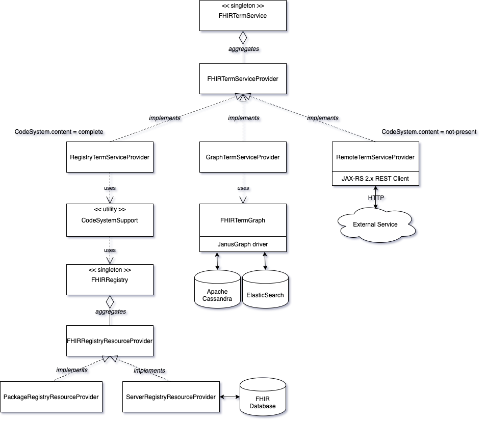

## Overview

The IBM FHIR Server Terminology module ([fhir-term](https://github.com/IBM/FHIR/tree/main/term/fhir-term)) provides a FHIR terminology service provider interface (SPI) and a default implementation that implements terminology services using `CodeSystem`, `ValueSet`, and `ConceptMap` resources that have been made available through the FHIR registry module ([fhir-registry](https://github.com/IBM/FHIR/tree/main/fhir-registry)).

## FHIR Terminology Service Diagram



## FHIR Terminology Service Provider Interface (SPI)

The FHIR Terminology Service Provider interface provides a mechanism for implementers to provide terminology capabilities via the Java ServiceLoader. The interface includes method signatures for `closure`, `getConcept`, `getConcepts`, `hasConcept`, `hasConcepts`, `isSupported` and `subsumes`:

```java
public interface FHIRTermServiceProvider {
    Set<Concept> closure(CodeSystem codeSystem, Code code);
    Map<Code, Set<Concept>> closure(CodeSystem codeSystem, Set<Code> codes);
    Concept getConcept(CodeSystem codeSystem, Code code);
    Set<Concept> getConcepts(CodeSystem codeSystem);
    <R> Set<R> getConcepts(CodeSystem codeSystem, Function<Concept, ? extends R> function);
    Set<Concept> getConcepts(CodeSystem codeSystem, List<Filter> filters);
    <R> Set<R> getConcepts(CodeSystem codeSystem, List<Filter> filters, Function<Concept, ? extends R> function);
    boolean hasConcept(CodeSystem codeSystem, Code code);
    boolean hasConcepts(CodeSystem codeSystem, Set<Code> codes);
    boolean isSupported(CodeSystem codeSystem);
    boolean subsumes(CodeSystem codeSystem, Code codeA, Code codeB);
}
```

NOTE: `closure(CodeSystem, Set)`, `getConcepts(CodeSystem, Function)`, `getConcepts(CodeSystem, List, Function)` and `hasConcepts(CodeSystem, Set)` all have default implementations in the `FHIRTermServiceProvider` interface.

## Registry Terminology Service Provider Implementation

The default implementation of `FHIRTermServiceProvider` ([RegistryTermServiceProvider](https://github.com/IBM/FHIR/blob/main/term/fhir-term/src/main/java/com/ibm/fhir/term/service/provider/RegistryTermServiceProvider.java)) leverages terminology resources (`CodeSystem`, `ValueSet`, and `ConceptMap`) that have been made available through the FHIR registry module ([fhir-registry](https://github.com/IBM/FHIR/tree/main/fhir-registry)). It supports `CodeSystem` resources with *complete* content (`CodeSystem.content = 'complete'`) and `ValueSet` resources that reference `CodeSystem` resources that have complete content.

## FHIR Terminology Service Singleton Facade

The FHIR Terminology Service Singleton facade ([FHIRTermService](https://github.com/IBM/FHIR/blob/main/term/fhir-term/src/main/java/com/ibm/fhir/term/service/FHIRTermService.java)) loads a list of `FHIRTermServiceProvider` instances from the ServiceLoader and includes an instance of the `RegistryTermServiceProvider`. Client code (Java) that requires terminology capabilities should access them via the `FHIRTermService` singleton facade. Here is an example:

```java
ValueSet valueSet = ValueSetSupport.getValueSet("http://ibm.com/fhir/ValueSet/vs1");
Coding coding = Coding.builder()
        .system(Uri.of("http://ibm.com/fhir/CodeSystem/cs1"))
        .version(string("1.0.0"))
        .code(Code.of("a")
        .display(string("concept a")
        .build();
ValidationOutcome outcome = FHIRTermService.getInstance().validateCode(valueSet, coding);
```

The `expand `, `lookup`, `validateCode` (CodeSystem), `validateCode` (ValueSet), and `translate` methods support the passing of optional parameters (e.g. `ExpansionParameters`, `LookupParameters`, etc.). Many of the methods also return an "outcome" object. These "parameter" and "outcome" objects are modeled after the input/output parameters specified in the terminology operations from the FHIR Terminology module: [http://hl7.org/fhir/terminology-module.html](http://hl7.org/fhir/terminology-module.html).

The "parameter" objects can be created from a `Parameters` resource:

```java
Parameters parameters = ...;
ExpansionParameters expansionParameters = ExpansionParameters.from(parameters);
```

The "outcome" objects can be converted to a Parameters resource:

```java
LookupOutcome outcome = ...;
Parameters parameters = outcome.toParameters();
```

NOTE: The current implementation of `FHIRTermService` does not support optional parameters (e.g. `ExpansionParameters`, `TranslationParameters`, `ValidationParameters`, etc.).

## FHIR Server Terminology Extended Operations

The FHIR terminology operations module ([fhir-operation-term](https://github.com/IBM/FHIR/tree/main/term/operation/fhir-operation-term)) connects the FHIR Server REST layer to the FHIR terminology module via the operations framework. This module implements the terminology operations as defined in the FHIR terminology service specification [http://hl7.org/fhir/terminology-service.html](http://hl7.org/fhir/terminology-service.html). One exception is the `$closure` operation. The `$closure` operation is experimental and does not support versioning or replay. This means that the `$closure` operation will always return the set of closure table entries for the given input concepts and does not store client state.

## FHIRPath Terminology Functions

The FHIRPath module ([fhir-path](https://github.com/IBM/FHIR/tree/main/fhir-path)) has been updated to support implementations of the draft FHIRPath terminology function specification: [http://hl7.org/fhir/fhirpath.html#txapi](http://hl7.org/fhir/fhirpath.html#txapi). Support for the following functions (accessed through the `%terminologies` constant) has been implemented:

```
%terminologies.expand(valueSet, params) : ValueSet
%terminologies.lookup(coded, params) : Parameters
%terminologies.validateVS(valueSet, coded, params) : Parameters
%terminologies.validateCS(codeSystem, coded, params) : Parameters
%terminologies.subsumes(system, coded1, coded2, params) : code
%terminologies.translate(conceptMap, code, params) : Parameters
```

Here is the same example from above but going through the FHIRPath evaluator:

```java
Coding coding = Coding.builder()
        .system(Uri.of("http://ibm.com/fhir/CodeSystem/cs1"))
        .version(string("1.0.0"))
        .code(Code.of("a")
        .display(string("concept a")
        .build();
Collection<FHIRPathNode> initialContext = singleton(FHIRPathElementNode.elementNode(coding));
FHIRPathEvaluator evaluator = FHIRPathEvaluator.evaluator();
Collection<FHIRPathNode> result = evaluator.evaluate("%terminologies.validateCode('http://ibm.com/fhir/ValueSet/vs1', %context)");

```

Additionally, the FHIRPath functions `subsumedBy` and `subsumes` have been implemented per: [http://hl7.org/fhir/fhirpath.html#functions](http://hl7.org/fhir/fhirpath.html#functions)

## Graph Terminology Service Provider Implementation (experimental)

The FHIR term graph module [fhir-term-graph](https://github.com/IBM/FHIR/tree/main/term/fhir-term-graph) provides an implementation of `FHIRTermServiceProvider` that is backed by a graph database ([JanusGraph](https://janusgraph.org)). The module also contains term graph loaders for SNOMED-CT Release Format 2 (RF2) files (SnomedTermGraphLoader), UMLS Rich Release Format (RRF) files (UMLSTermGraphLoader), and FHIR CodeSystem resources (CodeSystemTermGraphLoader). Graph term service providers may be enabled / configured through the `fhir-server-config.json` file per the configuration properties specified in the [FHIR Server User's Guide](https://ibm.github.io/FHIR/guides/FHIRServerUsersGuide#51-configuration-properties-reference).

Example configurations:

``` json
            "graphTermServiceProviders": [{
                "__comment": "Configuration for Berkeley DB Java Edition + Lucene",
                "enabled": false,
                "configuration": {
                    "storage.backend": "berkeleyje",
                    "storage.directory": "data/graph",
                    "index.search.backend": "lucene",
                    "index.search.hostname": "data/searchindex",
                    "storage.read-only": true,
                    "query.batch": true,
                    "query.batch-property-prefetch": true,
                    "query.fast-property": true
                }
            },{
                "__comment": "Configuration for Apache Cassandra + ElasticSearch",
                "enabled": true,
                "timeLimit": 10000,
                "configuration": {
                    "storage.backend": "cql",
                    "storage.hostname": "127.0.0.1",
                    "index.search.backend": "elasticsearch",
                    "index.search.hostname": "127.0.0.1:9200",
                    "storage.read-only": true,
                    "query.batch": true,
                    "query.batch-property-prefetch": true,
                    "query.fast-property": true
                }
            }],
```

## Remote Terminology Service Provider Implementation (experimental)

The FHIR term remote module [fhir-term-remote](https://github.com/IBM/FHIR/tree/main/term/fhir-term-remote) provides an implementation of `FHIRTermServiceProvider` that connects to an external service using a REST client to access code system content. The external service must implement the FHIR REST terminology APIs documented [here](http://hl7.org/fhir/terminology-service.html). Remote term service providers may be enabled / configured through the `fhir-server-config.json` file per the configuration properties specified in the [FHIR Server User's Guide](https://ibm.github.io/FHIR/guides/FHIRServerUsersGuide#51-configuration-properties-reference).

Example configurations:


``` json
            "remoteTermServiceProviders": [{
                "__comment": "Configuration for public SNOMED-CT endpoint",
                "enabled": true,
                "base": "https://snowstorm-fhir.snomedtools.org/fhir",
                "supports": [{
                    "system": "http://snomed.info/sct"
                }]
            },{
                "__comment": "Configuration for public LOINC endpoint",
                "enabled": true,
                "base": "https://fhir.loinc.org",
                "basicAuth": {
                    "username": "loincUsername",
                    "password": "loincPassword"
                
                },
                "supports": [{
                    "system": "http://loinc.org"
                }]
            }]
```