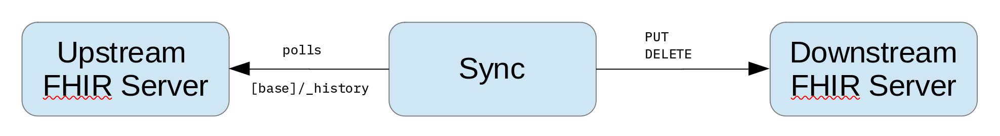

# Project: fhir-flow

fhir-flow is a stand-alone application demonstrating how the FHIR whole-system history interaction can be used for system-to-system synchronization.


[FHIR R4 History Interaction](https://www.hl7.org/fhir/http.html#history)
> "The history interaction can be used to set up a subscription from one system to another, so that resources are synchronized between them"



## Build

At this time, fhir-flow is provided for demonstration purposes only and should be considered experimental.

To build fhir-flow, clone the git repository and build as follows:

```
git clone git@github.com:IBM/FHIR.git
cd FHIR
mvn clean install -f fhir-examples
mvn clean install -f fhir-parent
mvn clean install -f fhir-flow
```

Note that at this time, fhir-flow is not built by default so its project must be built explicitly as shown above.

## Running fhir-flow

The fhir-flow application accepts two properties files defining access to the upstream and downstream FHIR servers:

1. `--upstream-properties` the properties describing the location of the FHIR server from which we pull the change history (the **upstream** server);
2. `--downstream-properties` the properties describing the location of the **downstream** FHIR server to which we will push each change pulled from the **upstream** server.

If no downstream properties are provided, the application simply logs the interaction type and identity of each resource received from the upstream history calls. This is a useful test to see how quickly you can pull the change history from your server.

```
java \
  -Djava.util.logging.config.file=logging.properties \
  -jar "fhir-flow-4.11.0-SNAPSHOT-cli.jar" \
  --run-duration 10 \
  --upstream-properties upstream.properties \
  --upstream-tenant your-upstream-tenant-name
```

The `logging.properties` file can be set up as follows:

```
handlers=java.util.logging.ConsoleHandler,java.util.logging.FileHandler
.level=INFO

# Console output
java.util.logging.ConsoleHandler.level = INFO
java.util.logging.ConsoleHandler.formatter=com.ibm.fhir.database.utils.common.LogFormatter

# What level do we want to see in the log file
java.util.logging.FileHandler.level=INFO

# Log retention: 50MB * 20 files ~= 1GB
java.util.logging.FileHandler.formatter=com.ibm.fhir.database.utils.common.LogFormatter
java.util.logging.FileHandler.limit=50000000
java.util.logging.FileHandler.count=20
java.util.logging.FileHandler.pattern=fhirflow-%u-%g.log
```

The properties file describing either the upstream or downstream FHIR servers:

```
read.timeout=250000
connect.timeout=20000
fhir.server.host=localhost
fhir.server.port=9443
fhir.server.endpoint=/fhir-server/api/v4/
fhir.server.user=fhiruser
fhir.server.pass=change-password
truststore=fhirClientTrustStore.p12
truststore.pass=change-password
pool.connections.max=400
```

For development, testing or demonstration purposes you can use the same FHIR server for both upstream and downstream - just make sure you specify different tenants.

For example, to replicate changes from tenant1 to tenant2 on a local file server:

```
java \
  -Djava.util.logging.config.file=logging.properties \
  -jar "fhir-flow-4.11.0-SNAPSHOT-cli.jar" \
  --run-duration 1800 \
  --upstream-properties local.properties \
  --upstream-tenant tenant1 \
  --downstream-properties local.properties \
  --downstream-tenant tenant2
```

The fhir-flow application periodically writes opaque CHECKPOINT values to the log file:

```
2022-04-19 17:03:11.982 00000001    INFO impl.UpstreamFHIRHistoryReader CHECKPOINT: X2NvdW50PTUxMiZfZXhjbHVkZVRyYW5zYWN0aW9uVGltZW91dFdpbmRvdz10cnVlJl9zb3J0PW5vbmUmX2NoYW5nZUlkTWFya2VyPTEwMjM=
```

When the run duration time is reached, the application waits for any pending work to complete then writes a FINAL CHECKPOINT message:

```
2022-04-19 17:03:12.983 00000001    INFO impl.UpstreamFHIRHistoryReader FINAL CHECKPOINT: X2NvdW50PTUxMiZfZXhjbHVkZVRyYW5zYWN0aW9uVGltZW91dFdpbmRvdz10cnVlJl9zb3J0PW5vbmUmX2NoYW5nZUlkTWFya2VyPTEwMjM=
```

The checkpoint value can be used to resume processing using the `--from-checkpoint` parameter:

```
java \
  -Djava.util.logging.config.file=logging.properties \
  -jar "fhir-flow-4.11.0-SNAPSHOT-cli.jar" \
  --run-duration 1800 \
  --upstream-properties local.properties \
  --upstream-tenant tenant1 \
  --downstream-properties local.properties \
  --downstream-tenant tenant2 \
  --from-checkpoint "X2NvdW50PTUxMiZfZXhjbHVkZVRyYW5zYWN0aW9uVGltZW91dFdpbmRvdz10cnVlJl9zb3J0PW5vbmUmX2NoYW5nZUlkTWFya2VyPTEwMjM="
```

## Command Line Options

| Option | Description |
| ------ | ----------- |
| --run-duration {seconds} | The number of seconds to run before terminating |
| --upstream-properties {properties-file} | A Java properties file containing connection details for the upstream FHIR server |
| --upstream-tenant {tenant-name} | The IBM FHIR Server upstream tenant name |
| --downstream-properties {properties-file} | A Java properties file containing connection details for the downstream FHIR server |
| --downstresam-tenant {tenant-name} | The IBM FHIR Server downstream tenant name |
| --from-checkpoint {checkpoint-value} | Start processing from this previously reported checkpoint value |
| --partition-count {n} | The number of parallel partitions to use for writing to the downstream FHIR server |
| --partition-queue-size {n} | The number of interactions that can be queued into any partition before blocking further fetches. This puts an upper bound on memory consumption when changes can be fetched more quickly than written to the downstream system, which is often the case. |
| --reader-pool-size {n} | The size of the thread-pool used to support asynchronous reading of upstream resources |
| --drain-for-seconds {seconds} | After the run-duration time has elapsed, wait this number of seconds for the downstream partition queues to empty before exiting |
| --parse-resource | Parse each resource received from the upstream system. The default mode is to not parse the resource, and treat the payload as an opaque string which is simply passed from upstream to downstream - thus saving a significant amount of CPU and pressure on the GC. |
| --log-data | When in log-only mode (not writing to an actual downstream system), include the resource payload data when logging each interaction. |
| --exclude-transaction-window | When upstream is an IBM FHIR, use the `_excludeTransactionTimeoutWindow=true` query parameter when fetching history to avoid potential issues with missing data in high-volume scenarios. |

# Ideas for Future Development

1. Replace the downstream writer with a Kafka client and push the change interactions as messages into Kafka. The fetching (VREAD) and subsequent processing of the interaction messages can then be easily scaled out across a large number of nodes.
2. Use this mechanism to drive bulk export functionality
3. The upstream reader could be replaced with reading from an NDJSON file and this could be used to implement bulk import.
4. Implement a different type of partitioner and downstream writer to support packaging data in different formats such as Apache Parquet.
5. The checkpoint Tracker implementation should be reusable for fhir-bucket client-driven reindex operations.
