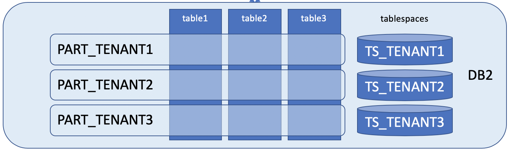
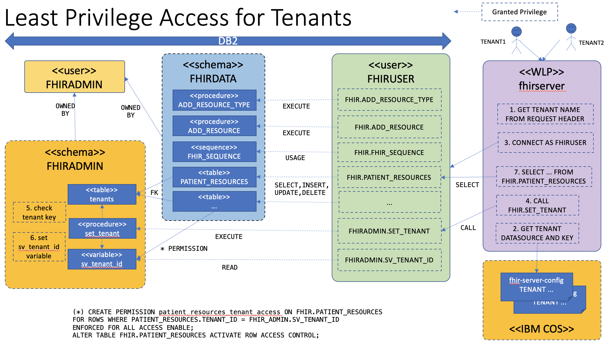
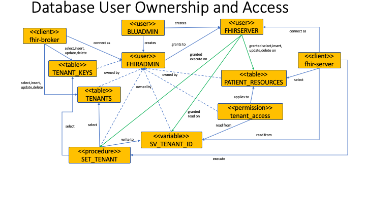

# The IBM FHIR Server - Multi-Tenancy on Db2

This document outlines the schema design and implementation for the IBM FHIR Server's Multi-tenancy feature on Db2.

The Multi-tenancy feature has two main areas of focus: 
- Tenant Provisioning  
- Security

This document assumes familiarity with the general [IBM FHIR Server schema design](SchemaMigration.md).

# Multi-Tenancy Concepts and Design

The IBM FHIR Server design supports three levels of multi-tenancy:

1. Separate database per tenant. Each tenant can specify a unique database in its fhir-server-config.json file. Each database gets its own FHIR_ADMIN schema. Each database should be run on its own host.
2. Separate data schema per tenant. Each tenant can specify a different schema in its fhir-server-config.json file. The database shares a common FHIR_ADMIN schema. Each tenant may be configured to use separate credentials with the corresponding users granted explicit access to the objects in the tenant's schema.
3. (Db2-only) multiple tenants per schema, partitioned with row-based access control and per-tenant tablespaces.

Of course, an entire deployment (application servers and database) also could be dedicated to a single tenant, which is really just a variant of option 1 above, although clearly such a configuration would not be considered multi-tenant.

## Tenant Data Administration

The IBM FHIR Server separates schema administration data from user data. All administration data is held in tables within the FHIR_ADMIN schema, and these tables are not directly accessible by the IBM FHIR Server database user.

The FHIR_ADMIN schema is used to manage schema version migrations as well as tenant configuration for any tenants resident in the given database. The FHIR_ADMIN schema does not manage tenants in other databases.

See the general [IBM FHIR Server schema design](SchemaMigration.md) documentation for a more detailed description of how FHIRADMIN tables are used to manage schema versions.


## Multi-tenancy using Db2 Table Partitions and Per Tenant Tablespaces

The IBM FHIR Server provides a multi-tenancy feature based on Db2 row-based access control and table partitioning features.

Each new tenant is allocated a unique tenant id value which is of database type `INT`. All tables in the IBM FHIR Server data schema (typically `FHIRDATA`) are created as range partitioned and configured with row-based access control. 

Note, the common schema used for FHIR tables is `fhirdata`. The following examples are illustrative only for the purpose of describing how partitioning and row permission controls are used to provide multi-tenancy. The schema `example` and the tables shown below are therefore not real objects found in an actual IBM FHIR Server Db2 instance.

The following DDL creates a table of patients which, for this example, are uniquely defined by a patient_name:

```
CREATE TABLE example.patients (
    mt_id               INT     NOT NULL,
    patient_name    VARCHAR(18) NOT NULL,
    age                 INT     NOT NULL,
    doctor_name     VARCHAR(18),
    ssn                CHAR(11),
    CONSTRAINT pk_patient PRIMARY KEY (mt_id, patient_name)
)
PARTITION BY RANGE (mt_id) (STARTING 0 INCLUSIVE ENDING 0 INCLUSIVE);
```

Each tenant is allocated a unique integer value for mt_id (multi-tenant id), with a range partition used to define which table partition is to be used for a particular tenant's mt_id. The mapping of tenant name to mt_id value is maintained in the `FHIR_ADMIN.TENANTS` table.

Query predicates must therefore always include a filter on mt_id to ensure only data for the matching tenant is accessed. Leaving this to the application would be onerous, and likely error-prone with significant risks for data privacy. To avoid this, the design uses a row permission object attached to each table. This is described fully in a later section, but the net is that this permission object automatically adds a `WHERE mt_id = ...` predicate to every query, which means that the application doesn't have to concern itself with this.

The above example assumes that patient_name will be unique within the context of a single tenant, which obviously does not apply to the actual IBM FHIR Server schema. The primary key must include the partition range key `mt_id`. In addition, any secondary indexes MUST also include mt_id to ensure they are always local to the partition. For example:

```
CREATE UNIQUE INDEX example.unq_ssn ON example.patients(mt_id, ssn);
```

Local indexes are important to ensure proper tenant data isolation, with the added benefit of simplifying the task of removing the tenant when the time comes.

## Per-Tenant Tablespaces

Each tenant is allocated its own tablespace, and the table and index partitions for that tenant are all assigned to that tablespace, as depicted below:

>

Note: historically, DBAs would often cook up complex database layouts, using different tablespaces for tables and indexes to try and balance the IO workload for optimal throughput and/or latency. In cloud environments with heavily virtualized storage, this becomes less relevant and so leveraging tablespaces to provide an application function (isolating tenant data) is reasonable.

Each tablespace is mapped to one or containers which are typically files at the OS filesystem level. When the tablespace is dropped, these files are deleted. The schema also defines a common tablespace `FHIR_TS` which is used for the base table definition. Db2 requires that a table and its partitions must use tablespaces with the same extent size.

The tablespaces are created with automatic storage using an EXTENTSIZE of 4 (x32KB) pages to reduce overhead and improve deployment times. This is due to the large number of objects (tables and indexes) created in the schema, each requiring an initial number of extents. 

To add a new tenant, a utility program connects to Db2 as the FHIRADMIN user and adds records to the FHIR_ADMIN.TENANTS and FHIR_ADMIN.TENANT_KEYS tables. The utility probram then uses the newly assigned mt_id value when adding new partitions to each of the tables in the FHIRDATA schema.

The tablespace is managed automatically with an ([EXTENTSIZE](https://www.ibm.com/support/knowledgecenter/SSEPGG_11.5.0/com.ibm.db2.luw.admin.dbobj.doc/doc/c0004964.html)) of 128KB. Note, the extentsize is multiplied by the pagesize to arrive at a storage size.

Each tenant is allocated a partition based on the MT_ID and assigned to a tablespace. The tenant tablespace is created one time and no changes to the tablespace are expected.

In general, smaller extent sizes can harm the performance of table and index scans because they limit the amount of data which can be read in a single IO operation. However, such scans are not common in most FHIR query use-cases, so this tends to not be an issue.


## Multi-tenant Queries

We could use the multi-tenant enabled table definition as-is and modify every SQL statement to include `AND mt_id = ?` but this is error-prone and risky. If a query was missed or poorly written and ran without that predicate, it could expose data from another tenant.

Instead, we leverage DB2 permission objects which allow us to specify a filter condition. Each query submitted by the application is rewritten by the database to include the `FOR ROWS WHERE` predicate, which is defined as: 

```
CREATE PERMISSION ROW_ACCESS ON example.patients
         FOR ROWS WHERE patients.mt_id = example.session_tenant
         ENFORCED FOR ALL ACCESS
           ENABLE;

ALTER TABLE example.patients ACTIVATE ROW ACCESS CONTROL;
```

The `session_tenant` above is defined as a session variable. The application must set the value to match the mt_id value configured for the tenant.

Logically:

```
SET example.session_tenant = 1;
SELECT * FROM example.patients;
commit;
```

Internally, DB2 rewrites the query to look like this:

```
SELECT * FROM example.patients WHERE mt_id = 1;
```

Because the table `example.patients` is partitioned using mt_id, the query optimizer is able to perform a partition-prune, thereby limiting the query access to the partition associated with the tenant. This results in a query execution plan very similar in terms of performance to a single-tenant scenario without any partitioning.

To isolate a tenant's data at the file-system level, a tablespace is created per tenant and the partition objects are are allocated to that tablespace, including any local indexes:

```
CREATE TABLESPACE TS_TENANT1 MANAGED BY AUTOMATIC STORAGE;
CREATE TABLESPACE TS_TENANT2 MANAGED BY AUTOMATIC STORAGE;
```


Adding new tenants requires adding partitions to each table in the data schema. Note how the partition is configured with the tenant's specific tablespace:

```
-- for tenant #1
ALTER TABLE example.patients ADD PARTITION TENANT1 STARTING 1 INCLUSIVE ENDING 1 INCLUSIVE IN TS_TENANT1;

-- for tenant #2
ALTER TABLE example.patients ADD PARTITION TENANT2 STARTING 2 INCLUSIVE ENDING 2 INCLUSIVE IN TS_TENANT2;
```

When the tenant is deleted, the partition associated with the tenant is detached and subsequently dropped from the database. This renders the tenant data inaccessible from the perspective of a database user. However, database space management does not necessarily overwrite the freed blocks. Although the data is encrypted, someone with the database key and sufficient time, tooling and knowledge could theoretically retrieve parts of the data. By using a tablespace which is dropped, the database will delete the files at the OS layer.

The process to delete a tenant is (logically):

```
ALTER TABLE <tbl> DETACH PARTITION INTO <tbl_drp1>;
...
COMMIT;
DROP TABLE <tbl_drp1>;
...
COMMIT;
DROP TABLESPACE TS_TENANT1;
```

In this case, TS_TENANT1 is the name of the tablespace previously assigned to the tenant being dropped.

Note that Db2 requires a commit after the partition is detached and before the table `<tbl_drp1>` can be dropped. The tooling must implement this process to be idempotent to handle cases where a detach or drop might fail.

Dropping partitions in this way works by swizzling metadata in the catalog which requires very little (redo) logging and is therefore far more efficient than deleting actual rows of data.


## Tenant Authentication

The server connects to Db2 with a user configured for the least privileges it requires to provide the FHIR resource persistence and search functions. This user does not have any database administration privileges, unlike the FHIRADMIN user which is used to deploy the schema and allocate tenants etc.



To prevent an application (or other user with access to the applications database connection information) from arbitrarily setting the session_tenant value, the user used by the IBM FHIR server to connect is granted only read access to the variable. This is why we create the session_tenant variable in the FHIR_ADMIN schema, owned by the FHIRADMIN user, not the FHIRDATA schema, which is the default schema for the user used by the server to access the database. In order to set (write) its value, the data user is granted execute privileges on a Db2 stored procedure called FHIR_ADMIN.SET_TENANT. This is the only way a non-administrative user can set the session_tenant value and access the data.

The following table summarizes the properties/values involved in authenticating tenant access:

| Property | Description |
|----------|-------------|
|TENANT_NAME | Used by applications to uniquely identify tenants |
| MT_ID | The integer primary key of the TENANTS table, used to map the TENANT_NAME to an integer value which is used as the partitioning key and row-based access permission predicate. |
| TENANT_KEY | A 32 byte random value created when the tenant is provisioned. This is a secret, and must be passed by the client to the database in order to obtain access to a tenant. A tenant may have multiple tenant keys to support key rotation. (deploy new key before removing old key) |
| TENANT_SALT | A 32 byte random value used as a salt when computing the SHA-256 tenant hash |
| TENANT_HASH | A SHA-256 hash of the TENANT_KEY and TENANT_SALT. The TENANT_KEY is never stored directly by the database. |


The FHIR_ADMIN.SET_TENANT stored procedure takes two parameters: the tenant name and the tenant key. This acts as an authorization key. The SET_TENANT code looks up a previously stored salt value associated with the tenant name and computes a hash of the salt + tenant key. If the result matches the stored hash value, the call is considered authentic, and the session_tenant variable is set.

To summarize, for a client application to access tenant data in the multi-tenant Db2 schema, the following must apply:

1. The client (e.g. the server) must have access to the database as the FHIRSERVER user;
2. The user FHIRSERVER must be granted execute privilges on the FHIR_ADMIN.SET_TENANT procedure;
3. The user FHIRSERVER must be granted READ on FHIR_ADMIN.SV_TENANT_ID;
4. The user FHIRSERVER must be granted SELECT,INSERT,UPDATE,DELETE on all tables in the FHIRDATA schema. 

## Summary of Granted Privileges:

| Grants |
| --- |
| All objects in schema FHIR_ADMIN are owned by user FHIRADMIN |
| All objects in schema FHIRDATA are owned by user FHIRADMIN |
| GRANT EXECUTE ON FHIR_ADMIN.SET_TENANT TO FHIRSERVER; |
| GRANT READ ON FHIR_ADMIN.SV_TENANT_ID TO FHIRSERVER; |
| GRANT EXECUTE ON FHIRDATA.ADD_RESOURCE_TYPE TO FHIRSERVER; |
| GRANT EXECUTE ON FHIRDATA.ADD_RESOURCE TO FHIRSERVER; |
| GRANT SELECT,INSERT,UPDATE,DELETE ON FHIRDATA.PATIENT_RESOURCES TO FHIRSERVER; |


## Tenant Data Security

PHI controls require data at rest is encrypted, and this is implemented by using Db2 native encryption. When the tenant is deleted, its data must be rendered inaccessible. This is achieved by the following:

1. Detaching the tenant's partition and dropping the table created by the detach operation.
2. Dropping the tenant's tablespace, deletes the database container files on the underlying OS filesystem.

The above actions mean that the tenant's data would no longer be accessible at the database or file-system levels.

In the past, there may have been an argument for a third step involving scrubbing the files by overwriting their data with zeroes or random values. However, in today's data centers with heavily virtualized storage sub-systems, there would be no guarantee that such a write would overwrite the actual on-disk data blocks anyway (storage sub-systems may use copy-on-write techniques or similar approaches to provide snapshots, for example). In addition, when consuming Db2 as a cloud service, OS-level access is unlikely to be available, making a file scrub impossible, unless it was exposed by the cloud provider as a feature of the service.

Because dropping a tablespace causes Db2 to delete the underlying container files, any attempt to recover the data would require:

1. privileged access to the OS or storage sub-system;
2. the database encryption key;
3. detailed knowledge of OS file systems and data recovery tools;
4. detailed knowledge of Db2 internals and data recovery tools;
5. opportunity to retrieve the data before the OS reused the free blocks in the filesystem.


# Multi-Tenancy Schema

The design has an administrative schema and at least one tenant schema. Each tenant schema is in a separate tenant specific tablespace. 

## Schema: Administrative

The administrative schema's name is FHIR_ADMIN.  FHIR_ADMIN has 
- three tables: TENANTS, TENANT_KEYS, VERSION_HISTORY
- one sequence: FHIR_ADMIN.TENANT_SEQUENCE
- one stored procedure: SET_TENANT

The tables have supporting indicies and privileges. 


**Table: VERSION_HISTORY**

Before any table or schema object is created, the `VERSION_HISTORY` table is created using `CreateVersionHistory.createTableIfNeeded(adminSchemaName, adapter);`  This table includes VERSION_HISTORY for resources created in the schema. If an object in the schema is updated, then the VERSION_HISTORY table must be updated to track the changes. 

The `VERSION_HISTORY` table enables Tenant version isolation, so upgrades and patches are separately applied to the schema to which the tenant belongs. Specifically, if the tenant shares the table definitions with another client, the patching is applied to both tenants at the same time.  If the tenant has a specific schema, the table definitions may be updated independent of each other.

The `CreateVersionHistory` class controls the creation the `VERSION_HISTORY` table. Importantly, the VERISON_HISTORY table does not support migrations and changes. The Primary Key has a corresponding index `PK_VERSION_HISTORY`, and the code does not support updating the index. 

This table is an administrative table and should not require updating and migration. 


**Table: TENANTS**

The Tenants table maps a given tenant to the Multi-Tenant ID (MT_ID) for the given tenant.  The MT_ID is subsequently used to restrict row access based on the matching value. 

| Column Name | Data Type | Length | Null | Purpose |
|----------|---------------|---------------|---------------|---------------------------------------------|
| MT_ID | Integer | 4 | No | Unique ID identifying the Tenant's ID|
| TENANT_NAME | VARCHAR | 36 | No | The name of the tenant |
| TENANT_STATUS | VARCHAR | 16 | No | The status of the Tenant|

MT_ID is the value used to assign ROW Access Control in the Multi-Tenant schema. The MT_ID is assigned from the FHIR_ADMIN.TENANT_SEQUENCE.  The value is to 1 to 9999, with no cycles. 

Tenant Status is one of the following: 
| Status | Purpose |
|----------|---------------------------------------------|
| PROVISIONING | Indicates the tenant schema is in the process of adding a set of tenant tables/partitions |
| ALLOCATED | Indicates the process of creating the tenant schema is finished, and the schema is ready for use. Only allocated tenants are available for use in the `fhir-persistence-jdbc` code |
| FROZEN | Indicates the previous tenant data is not to be used, and the tenant data is in the process of being removed |
| DROPPED | Indicates the previous tenant data is now removed |
| FREE | Indicates a set of tables is provisioned, and available to be allocated to a specific tenant |

The `FHIR_ADMIN.TENANTS` table maps a given tenant to the Multi-Tenant ID (MT_ID) for the given tenant.  The MT_ID is subsequently used to restrict row access based on the matching value. 

`AdminSchemaGenerator.addTenantTable` method adds the TENANT table, and updates to this table definition requries a change to the setVersion (incrementing by 1). A corresponding change must be made to `FHIRSchemaGenerator.addTenantTable` method.

The primary key for TENANTS is MT_ID, and the relationship to TENANT_KEYS is one-to-many.

The TENANT_SEQUENCE sequence is created a single time, and is NOT replaced or upgraded at any point in time.  Changing the sequence value is not recommended. Doing so could risk the integrity of the database. The `fhir-persistence-schema` actions - `Allocate Tenant - AddTenantDAO` and `Add Tenant - AddTenantKeyDAO` depend on `next value for`.  If the sequence is removed, the `TENANT_SEQUENCE` must be manually recreated starting with an integer higher than the `TENANTS.MT_ID` and `TENANT_KEYS.TENANT_KEY_ID` otherwise a conflict with the PRIMARY_KEY in the `FHIR_ADMIN` tables occurs. 

The variable privileges (grants) are updated one time, and applied to `FHIRSERVER` user.  If you recreate the sequence, you must recreate the `USE` permission. 

**Table: TENANT_KEYS**

The Tenant Keys table stores a hashed version of the tenant specific key. Upon creating a session and calling the SET_TENANT procedure, the SET_TENANT queries the incoming key against the TENANT_KEYS database to map to a specific tenant MT_ID. 

`AdminSchemaGenerator.addTenantKeysTable` method adds the TENANT_KEYS table, and updates to this table definition requries a change to the setVersion (incrementing by 1).

``` java
this.tenantKeysTable = Table.builder(adminSchemaName, TENANT_KEYS
    .setVersion(2)
    .addIntColumn(        TENANT_KEY_ID,             false)
    .addIntColumn(                MT_ID,             false)
    .addVarcharColumn(      TENANT_SALT,        44,  false)
    .addVarbinaryColumn(    TENANT_HASH,        32,  false)
    .addUniqueIndex(IDX + "TENANT_KEY_SALT", TENANT_SALT)
    .addUniqueIndex(IDX + "TENANT_KEY_TIDH", MT_ID, TENANT_HASH)
    .addPrimaryKey("TENANT_KEY_PK", TENANT_KEY_ID)
    .addForeignKeyConstraint(FK + TENANT_KEYS + "_TNID", adminSchemaName, TENANTS, MT_ID)
    .setTablespace(fhirTablespace)
    .build(model);
```

Changes to the FHIR_ADMIN schema are not supported.

If a table in FHIR_ADMIN table is updated, the changes must be manually applied as the migration steps to the each table and their indices. The Java code must also be updated to indicate the version change, such as the following for `TENANTS`:

``` java
this.tenantsTable = Table.builder(adminSchemaName, TENANTS)
    .setVersion(1)
    .addIntColumn(            MT_ID,             false)
    .addVarcharColumn(      TENANT_NAME,        36,  false)
    .addVarcharColumn(    TENANT_STATUS,        16,  false)
    .addUniqueIndex(IDX + "TENANT_TN", TENANT_NAME)
    .addPrimaryKey("TENANT_PK", MT_ID)
    .setTablespace(fhirTablespace)
    .build(model);
```

If the UniqueIndex or ForeignKeyConstraint is removed, and the constraint has been previously applied to a database, the active schema must be updated, and the object must be dropped.


**Table: TENANT_KEYS**

The Tenant Keys table stores a hashed version of the tenant specific key. Upon creating a session and calling the SET_TENANT procedure, the SET_TENANT queries the incoming key against the TENANT_KEYS database to map to a specific tenant MT_ID. 

| Column Name | Data Type | Length | Null | Purpose |
|----------|---------------|---------------|---------------|---------------------------------------------|
| TENANT_KEY_ID | Integer | 4 | No | The ID is from the sequence, and is used to identify the unique entry in the row |
| MT_ID | Integer | 4 | No | Matches to the MT_ID in the TENANTS table |
| TENANT_SALT | VARCHAR | 44 | No | A 32 byte random value used as a salt when computing the SHA-256 tenant hash |
| TENANT_HASH | VARBINARY | 32 | No | Each tenant's data is encrypted. |

The tenant_key is a 32 byte random value created when the tenant is provisioned. This is a secret, and must be passed by the client to the database in order to obtain access to a tenant. A tenant may have multiple tenant keys to support key rotation. An example of the tenant key is `GQUHRi0ETFw0Xe+p1VtVDki4JFZs885bGM35hXRyq/E=`

Multiple keys per tenant are supported, and key rotation includes adding, and then subsequently removing prior keys. 

**Table: VERSION_HISTORY**

The VERSION_HISTORY table enables Tenant version isolation, so upgrades and patches are separately applied to the schema the tenant belongs. Specifically, if the tenant shares the table definitions with another client, the patching is applied to both tenants at the same time.  If the tenant has a specific schema, the table definitions may be updated independent of each other. 

| Column Name | Data Type | Length | Null | Purpose |
|----------|---------------|---------------|---------------|---------------------------------------------|
| SCHEMA_NAME | VARCHAR | 64 | No | The name of the schema where the object resides|
| OBJECT_TYPE | VARCHAR | 16 | No | The type of the object - Procedure, Sequence, Table, TableSpace, Variable |
| OBJECT_NAME | VARCHAR | 64 | No | The name of the object in the schema |
| VERSION | INTEGER | 4 | No | The version starting at one and incrementing with every version change |
| APPLIED | TIMESTAMP | 10 | No | The time of the latest object update |


**SV_TENANT_ID: SESSION VARIABLE**

The `FHIR_ADMIN.SV_TENANT_ID` session variable is used in a row permission object to isolate data among tenants. The variable is created in `FHIRSchemaGenerator.addVariable`, and its definition should not be modified. 

The variable privileges (grants) are updated one time, and applied to `FHIRSERVER` user. The `FHIRSERVER` gets only read access to this variable. To set the value of the variable, `FHIRSERVER` must call `FHIR_ADMIN.SET_TENANT` as described in the next section.

`FHIR_ADMIN.SET_TENANT` is created in the FHIR_ADMIN schema. If updates are made to the `set_tenant.sql`, the `FhirSchemaGenerator.buildAdminSchema`'s, do not change the version number. All procedures are applied as CREATE OR REPLACE, and so the new procedure text will simply overwrite the current definition, or create it if it does not exist at the time. The schema utility tool has a special option which only updates the procedures, which is useful for development. See the [schema utility tool](https://github.com/IBM/FHIR/tree/master/fhir-persistence-schema/README.md) guide for more information.

The SET_TENANT procedure is defined in the PhysicalDataModel as follows:

``` java
// The set_tenant procedure can be created after all the admin tables are done
ProcedureDef setTenant = model.addProcedure(this.adminSchemaName, 
    SET_TENANT, 
    FhirSchemaConstants.INITIAL_VERSION, 
    () -> SchemaGeneratorUtil.readTemplate(adminSchemaName, adminSchemaName, SET_TENANT.toLowerCase() + ".sql", null), 
    Arrays.asList(allAdminTablesComplete), 
    procedurePrivileges);
        setTenant.addTag(SCHEMA_GROUP_TAG, ADMIN_GROUP);
```

When the `fhir-persistence-schema` updateProcedure is executed, the READ grant is applied again, and the procedure is updated. The Procedure privilege is reset upon re-executing the action. 

Note the use of a lambda expression calling `SchemaGeneratorUtil.readTemplate`. This functional is used to provide the text of stored procedure when needed. This avoids loading potentially large amounts of text into the JVM and holding on to it until it is used. 


## Schema: Tenant-Specific

The tenant-specific data is partitioned and isolated in tenant-specific tablespace.  The tenant data is not mixed with other tenant data physically using the tablespace isolation.

Tenants are never able to see each other's data, each user is only able to see a single tenant's data. The IBM FHIR Server uses the [CREATE PERMISSION statement](https://www.ibm.com/support/knowledgecenter/SSHRBY/com.ibm.swg.im.dashdb.sql.ref.doc/doc/r0057429.html) to create a row permission that specifies a condition under which rows of the table can be accessed. 

The condition to access the content is based on the SQL variable FHIR_ADMIN.SV_TENANT_ID joined with each table's MT_ID (multi-tenant id). If you need to query all tenants, you need to write a specific stored procedure to loop over the tenant_ids and query the table with each variable set with each tenant_id, and aggregate in the stored procedure. 

Each tenant's data is able to be moved, backedup, restored or exported a tenant-at-a-time.  This approach allows tenant independent restore points, using [DB2 11.1: Backing up partitioned databases](https://www.ibm.com/support/knowledgecenter/SSEPGG_11.1.0/com.ibm.db2.luw.admin.ha.doc/doc/t0051366.html)

The isolated data supports tenant independent query plan caches, scaling and disambiguating tenant specific disk and space usage. The performance metrics are tenant specific, and diagnostics are tenant specific. 

**Table: Resources**

Each resource is contains a RESOURCE and LOGICAL RESOURCE table. `_LOGICAL_RESOURCES` has one record per logical resource.  `_RESOURCES` has one record for each version of each logical resource. 

For example, VISIONPRESCRIPTION has: 

```
VISIONPRESCRIPTION_RESOURCES
VISIONPRESCRIPTION_LOGICAL_RESOURCES
```

These values are mapped to specific FHIR Search value types, supporting parameter searches: 

```
VISIONPRESCRIPTION_COMPOSITES
VISIONPRESCRIPTION_DATE_VALUES
VISIONPRESCRIPTION_LATLNG_VALUES
VISIONPRESCRIPTION_NUMBER_VALUES
VISIONPRESCRIPTION_QUANTITY_VALUES
VISIONPRESCRIPTION_STR_VALUES
VISIONPRESCRIPTION_TOKEN_VALUES
```

There are also additional tables to support search: `LOGICAL_RESOURCE`, `RESOURCE_TYPES` and `PARAMETER_NAMES` These tables are paritioned, and are specific for each tenant. 

**Table: Global: LOGICAL_RESOURCE**

This table facilitates global search optimizations. 

| Column Name | Data Type | Length | Null | Purpose |
|----------|---------------|---------------|---------------|---------------------------------------------|
| MT_ID | Integer | 4 | No | Matches to the MT_ID in the TENANTS table |
| LOGICAL_RESOURCE_ID | Integer | 8 | No | The ID is from the sequence, and is used to identify the unique entry in the specific Resource row |
| RESOURCE_TYPE_ID | VARCHAR | 44 | No | Associates a Resource with a Resource Type using the value from the Resource Types table |
| LOGICAL_ID | VARCHAR | 255 | No | The unique tenant specific UUID assigned to the Resource |

**Table: Global: RESOURCE_TYPES**

The tenant specific table of resources, which are mapped to bigints as FKs to optimize global search. 

| Column Name | Data Type | Length | Null | Purpose |
|----------|---------------|---------------|---------------|---------------------------------------------|
| MT_ID | Integer | 4 | No | Matches to the MT_ID in the TENANTS table |
| RESOURCE_TYPE_ID | Integer | 4 | No | A unique Identifier identifying the type of the resource |
| RESOURCE_TYPE | VARCHAR | 32 | No | Each ResourceType |

**Table: Global: PARAMETER_NAMES**

The PARAMETER_NAMES table registers, for each tenant, a mapping from the Search Parameter `code` to an `integer`, which is used in the values table to uniquely identify the parameter name.  The parameters are only registered on extraction (Create, Update), and not populated on Search. 

| Column Name | Data Type | Length | Null | Purpose |
|----------|---------------|---------------|---------------|---------------------------------------------|
| MT_ID | Integer | 4 | No | Matches to the MT_ID in the TENANTS table |
| PARAMETER_NAME_ID | INTEGER | 4 | No | A unique integer for each parameter, and is stored along with the value in the Parameters VALUES table for each resource |
| PARAMETER_NAME | VARCHAR | 255 | No | The Parameter name which actually maps to the FHIR SearchParameter `code` |

Each row is secured using Db2 Row Permission. The Stored Procedure is the ONLY way for a user to set the variable, which is used in the Db2 Row Permission. 

Each tenant's data is encrypted.  For Db2 on Cloud, it uses Db2 native encryption. This means there is a single key that encrypts all the tenants. There is currently no way to encrypt each tenant's tablespace with a different key.

Offboarding a tenant's data is accomplished using dettach/drop partition, and subsequently dropping the tablespace. 

**Stored Procedures: Adding Lookup References**

The stored procedures `add_resource_type`, `add_parameter_name`, `add_code_system`, and `add_any_resource` are used to update the RESOURCE_TYPES, PARAMETER_NAMES and CODE_SYSTEMS tables respectively in a thread-safe manner. These procedures insert a new row for each new key value they receive, assigning a new INT identifier which is used in the foreign key relationships from the search parameter tables (e.g. PATIENT_STR_VALUES). The application is expected to cache the (string) key to int value mapping and therefore avoid having to call these functions every time.


**Stored Procedure: FHIR_ADMIN.SET_TENANT**

The FHIR_ADMIN.SET_TENANT is used at the beginning of a connection to the IBM FHIR Server's multi-tenant schema. The SET_TENANT takes as input: tenant_name VARCHAR(36), tenant_key  VARCHAR(44).  The content outputs a connection specific variable `fhir_admin.sv_tenant_id` with the `tenant.mt_id`, which is automatically applied to the INSERT,SELECT,UPDATE,DELETE.  Only tenant's with status ALLOCATED are allowed to execute the actions.

To use the stored procedure from the Db2 administrative console. 

* Map Tenant and Key to Tenant ID (Stored Procedure) - `CALL FHIR_ADMIN.set_tenant('a-tenant-name', 'BLAH_BLAH');`
* Show the value set for the session - `VALUES fhir_admin.sv_tenant_id;`
* Execute the query, such as `SELECT * FROM FHIRDATA.MEDICATION_RESOURCES`

**Schema: Permissions**

The diagram outlines the relationships between the administrative and tenant schema:



The Multi-tenant schema sets the following permissions: 
- All objects in schema FHIR_ADMIN are owned by user FHIRADMIN
- All objects in schema FHIRDATA are owned by user FHIRADMIN
- GRANT EXECUTE ON FHIR_ADMIN.SET_TENANT TO FHIRSERVER;
- GRANT READ ON FHIR_ADMIN.SV_TENANT_ID TO FHIRSERVER;
- GRANT EXECUTE ON FHIRDATA.ADD_RESOURCE_TYPE TO FHIRSERVER;
- GRANT EXECUTE ON FHIRDATA.ADD_RESOURCE TO FHIRSERVER;
- GRANT SELECT,INSERT,UPDATE,DELETE ON FHIRDATA.PATIENT_RESOURCES TO FHIRSERVER;

FHIRSERVER is granted a minimum set of privileges. 
The SET_TENANT procedure is the only way that the FHIRSERVER use can set the SV_TENANT_ID value.


## References
[StackExchange: Recommendations on Partitioning Multi-Tenant Data in SQL-Server](https://dba.stackexchange.com/questions/184969/recommendations-on-partitioning-multi-tenant-data-in-sql-server)

FHIR® is the registered trademark of HL7 and is used with the permission of HL7.
