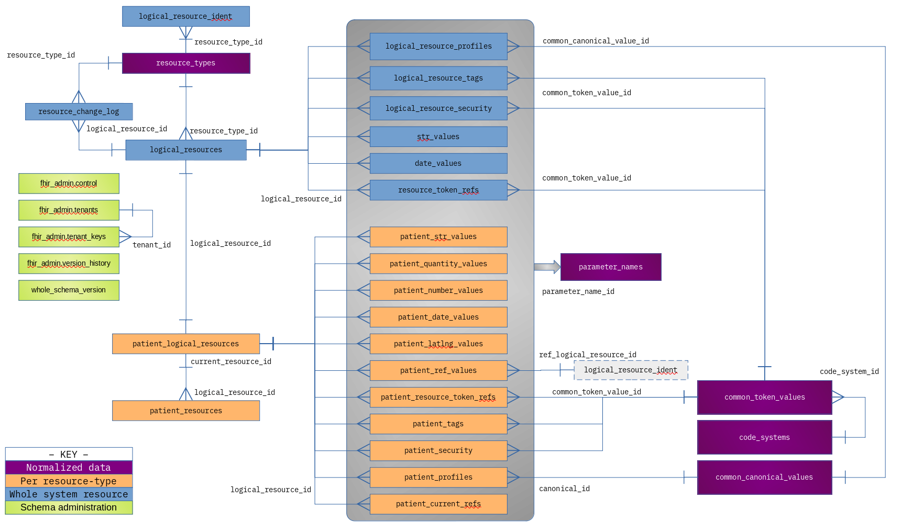

# The IBM FHIR Server - Schema Design and Management

_Note_: the following description is based on the standard Derby/PostgreSQL variant of the schema. For Db2, the logical model is the same, but the physical model uses table partitioning and row-based access control (RBAC) to support multi-tenancy. To facilitate this, all the primary and foreign key relationships are prefixed with a multi-tenant identifier `mt_id`. A complete description of the Db2 multi-tenant design can be found [here](DB2MultiTenancy.md). Other variations across databases are discussed in this document.

Currently it is not possible to deploy the single-tenant variant of the schema without RBAC to Db2. GitHub [issue-840](https://github.com/LinuxForHealth/FHIR/issues/840) has been opened to address this. 


----------------------------------------------------------------
# Overview and Concepts

The IBM FHIR schema is managed in code and is applied to a target database using a JDBC connection. This simplifies development of Derby-based unit-tests, allows a common schema definition to be used across multiple database flavors and simplifies deployment in cloud scenarios.

Because the data model dependencies are understood by the code, the schema creation process can be parallelized to reduce deployment times. In practice, however, we've found that the number of threads must be limited due to driving contention in the internal catalog tables (in DB2, for example). We have also found that some parallel object create operations cause internal database deadlocks (notably creating foreign key relationships). The implementation contains a retry loop, but may fail if the retry limit is exceeded. Note that these deadlocks are internal to Db2, not the more common kind typically caused by poor application code.

The `FHIR_ADMIN` schema is used to manage meta-data related to the actual data schemas. A single database instance can be used to support multiple FHIR data schemas, as long as the FHIR_ADMIN schema structure doesn't change. At the time of writing, the IBM FHIR Server does not support more than one FHIR_ADMIN schema in a single database. If a use-case arises where this is required, it is simply a matter of identifying in code where FHIR_ADMIN is used as a constant and replacing instances with a configurable property, although an implementation may also want to consider protecting individual schemas from accidentally being managed by more than one FHIR_ADMIN schema. One possible use-case for this sharing is using a database instance for schema development work.

The `FHIR_ADMIN` schema also plays an important role in managing tenants in the Db2 multi-tenant implementation. See the [Db2 Multi-Tenant Schema Design](DB2MultiTenancy.md) for more details.

**Table: VERSION_HISTORY**

Before any table or schema object is created, the `VERSION_HISTORY` table is created using `CreateVersionHistory.createTableIfNeeded(adminSchemaName, adapter);`  This table includes VERSION_HISTORY for resources created in the schema. If an object in the schema is updated, then the VERSION_HISTORY table must be updated to track the changes. 

The `VERSION_HISTORY` table enables tenant version isolation, so upgrades and patches are separately applied to the schema to which the tenant belongs.

The `CreateVersionHistory` class controls the creation the `VERSION_HISTORY` table. Importantly, the VERISON_HISTORY table does not support migrations and changes. The Primary Key has a corresponding index `PK_VERSION_HISTORY`, and the code does not support updating the index. 

This table is an administrative table and should not require updating and migration. 

## Differences Among Database Implementations

The following table highlights the main differences among the database implementations currently supported:

| Database   | Variation |
| --------   | ----------|
| DB2        | Multi-tenant. Supports multiple but isolated tenants within one database/schema |
| DB2        | An SPL stored procedure is used to implement the resource storage logic, reducing the number of application server to database round-trips, improving performance |
| DB2        | Uses `FHIR_TS` tablespace for admin tables, and a tablespace per tenant |
| DB2        | `FHIR_TS` is created using a small extent size for efficiency |
| PostgreSQL | Uses a function for the resource persistence logic |
| PostgreSQL | TEXT type used instead of CLOB for large data values |
| Derby      | Resource persistence is implemented at the DAO layer as a sequence of individual statements instead of one procedure call. At a functional level, the process is identical. Simplifies debugging and supports easier unit-test construction. |
| Citus      | Experimental. Distributed tables for large scale deployments. Most tables are distributed by logical_resource_id, except for `logical_resource_ident` which is distributed by `logical_id`. Search interactions using chaining or include/revinclude not currently supported.  |

----------------------------------------------------------------
# Schema Design - Physical Data Model

The IBM FHIR Server persists resources using tables defined in a data schema (usually FHIRDATA, but this can be anything). Multiple data schemas can exist in the same database, all managed from a single FHIR_ADMIN schema.

The resource-specific tables are generated by the `FhirResourceTableGroup` class which is called for each concrete resource type being provisioned.

The schema only stores search values relevant to the most recent resource version.

In addition to tables and indexes, each data schema contains the following sequences:

| Sequence Name | Description |
|----------|---------------------------------------------|
| `fhir_sequence` | Provides sequence numbers for the normalized resource ids |
| `fhir_ref_sequence` | Provides sequence numbers for reference tables such as PARAMETER_NAMES, CODE_SYSTEMS and RESOURCE_TYPES |

These sequences should not require updating and should never be altered as this would risk the integrity of existing data.

By convention, tables are named using the plural form of the data they represent. The following diagram shows the main relationships among tables in the schema. Note that only the search parameter tables for the Patient resource are shown. Each resource type gets its own set of search parameter tables.



## TABLESPACES

The Db2 multi-tenant schema variant uses a tablespace per tenant. All other database implementations use the default tablespace.

----------------------------------------------------------------
## Schema: FHIR_ADMIN

The Schema FHIR_ADMIN is deployed once per database and contains tables used to manage schema version history and tenant access (in the case of a multi-tenant supported configuration). The schema contains 3 tables:

| Object | Notes | Purpose |
| ----- | ----- | ------- |
| VERSION_HISTORY | | Table used to track the schema version number for each of the managed objects in the data schema (usually FHIRDATA) |
| TENANTS | Db2 only | Table for mapping between tenant name and the tenant id used to isolate the tenant's data in the data schema |
| TENANT_KEYS | Db2 only | Authorization keys allocated to a given given. A tenant can have multiple valid keys at any point in time to support rolling key changes (add new before remove old).
| TENANT_SEQUENCE | Db2 only | Sequence used to provide unique mt_id values for allocated tenants |
| SET_TENANT | Db2 only | Stored procedure. The only way for FHIRUSER to set the value of the SV_TENANT_ID session variable.


These table definitions are more completely described in [DB2MultiTenancy.md](DB2MultiTenancy.md). 

## Logical Resources, Resource Versions and Search Parameters

Each logical resource instance such as a Patient, Device or Observation is stored as a row in the `LOGICAL_RESOURCES` table. A corresponding row is also stored in a resource-specific logical resources tables for example: `PATIENT_LOGICAL_RESOURCES`, `DEVICE_LOGICAL_RESOURCES` or `OBSERVATION_LOGICAL_RESOURCES` etc.

Each logical resource also has record stored in `LOGICAL_RESOURCE_IDENT`. This table is used to hold all identifiers which could be the target of a relation. When a reference is external, the logical_id value will be the url target of the resource. In all other cases, the logical_id value will be the resource id value. As of release 5.0.0, the `LOGICAL_RESOURCE_IDENT` table is used for the `SELECT ... FOR UPDATE` locking used inside the `add_any_resource` stored procedures instead of logical_resources.

Each time a logical resource is updated a new version is created. Each new version is stored in the resource-type-specific table `xx_RESOURCES` where xx is the resource type name for example: `PATIENT_RESOURCES`, `DEVICE_RESOURCES` or `OBSERVATION_RESOURCES` etc. Unless payload offloading has been configured, the resource payload is rendered in JSON, compressed, and stored in the `DATA` column of this table. If payload offloading is configured, the `DATA` column will be null instead. 

Each version is allocated an integer `VERSION_ID` number starting from 1 which increments by 1 for each new version. Row locking (SELECT FOR UPDATE) guarantees there will be no gaps in the version numbers unless a version-specific `$erase` custom operation has been invoked. The `$erase` operation is the only time rows from the `xx_RESOURCES` table are ever deleted. HTTP `DELETE` interactions are implemented as _soft_ deletes and create a new version of the resource with the `xx_RESOURCES.IS_DELETED` column value equal to 'Y'. This column is repeated (denormalized) in the `xx_LOGICAL_RESOURCES` table as a performance optimization. Most queries need only non-deleted resources and the query is much faster if the join to the wide `xx_RESOURCES` table can be avoided. See the [Finding and Reading a Resource](#finding-and-reading-a-resource) section for practical examples on how data is accessed in the schema.

The following table describes the difference among the different key column names. These names were inherited from older schema implementations, which makes them a little harder to grasp initially:

| Column Name | Description |
| ----------- | ----------- |
| LOGICAL_ID  | The application value used to uniquely identify logical resource records. This value is passed by the application and is typically some form of UUID, and aligns with the FHIR `Resource.Id` |
| LOGICAL_RESOURCE_ID | The database assigned primary key for the LOGICAL_RESOURCES table |
| RESOURCE_ID | The database assigned primary key for the RESOURCES table |

The following table describes the purpose of each table or group of tables in the IBM FHIR Server data schema:

| Table Name | Type | Description |
| ---------- | ------ | --------------- |
| resource_types | Normalized data | FHIR R4 resource names |
| parameter_names | Normalized data | Search parameter names. |
| common_token_values | Normalized data | Normalized token and code system values. |
| common_canonical_values | Normalized data | Normalized canonical values. |
| logical_resource_ident | Whole system | One row for each logical resource or a reference to a logical resource. When the reference is external, the associated resource type will be `Resource`. |
| logical_resources | Whole system | One row for each logical resource, regardless of type. |
| resource_change_log | Whole system | One row for each CREATE, UPDATE or DELETE interaction. |
| xx_logical_resources | Resource | Resource-type specific entry for each logical resource. |
| xx_resources | Resource version | Resource-type specific entry for each version of a logical resource, including the resource payload unless payload offloading has been configured. |
| xx_str_values     | Resource parameters | String search parameters, with indexes for both plain and lower case (normalized) variants. |
| xx_number_values   | Resource parameters | Number search parameter values. |
| xx_quantity_values | Resource parameters | Quantity search parameter values. |
| xx_date_values     | Resource parameters | Date search parameter values. |
| xx_latlng_values   | Resource parameters | Latitude/longitude search parameter values. |
| xx_ref_values      | Resource parameters | Reference search parameter values. The reference values are normalized, with the target values stored as records in logical_resource_ident. |
| xx_resource_token_refs       | Resource parameters | Token search parameter values. The token values are normalized to save space from repeating long strings. This table acts as a mapping table between the normalized values stored in COMMON_TOKEN_VALUES and the logical resource. |
| xx_tags           | Resource parameters | Tag search parameters. Tag is a search parameter (rather than a type of search parameter) so no reference to PARAMETER_NAMES is needed. Tags are token values which are normalized in the COMMON_TOKEN_VALUES table. This table acts as a mapping between the normalized value and the logical resource. |
| xx_profiles           | Resource parameters | Profile search parameters. Profile is a search parameter (rather than a type of search parameter) so no reference to PARAMETER_NAMES is needed. |
| xx_security           | Resource parameters | Security search parameters. Security is a search parameter (rather than a type of search parameter) so no reference to PARAMETER_NAMES is needed. |
| xx_current_refs       | Resource parameters | Problems, Medications, Allergies, Drug allergies current lists. |
| str_values                 | Whole system parameters | Whole-system search string values. |
| date_values                | Whole system parameters | Whole-system search date values. |
| resource_token_refs        | Whole system parameters | Whole-system search token values. Mapping table to common_token_values. |
| logical_resource_profiles  | Whole system parameters | Whole-system search profile values. |
| logical_resource_tags      | Whole system parameters | Whole-system search tag values. |
| logical_resource_security  | Whole system parameters | Whole-system search security values. |
| erased_resources  | Resource | For internal use by the `$erase` custom operation to track erased resources. |

### Composites Search Parameters

Search parameters which are part of a composite value include a value in their `COMPOSITE_ID` column. This is used to tie together the multiple parameters when evaluating composite parameter expressions in search queries. This approach means that the same search value may be stored more than once. This has to be taken into account when constructing search queries to avoid duplicate rows in the result.

## Finding and Reading a Resource

Note: see the section describing Citus for a more efficient way to read a resource when using the `DISTRIBUTED` variant of the schema.

The name of the FHIR resource type is normalized and stored in the `RESOURCE_TYPES` table. The `RESOURCE_TYPE_ID` is then used as a foreign key to reference the resource type throughout the schema.

```
fhirdb=> \d fhirdata.resource_types
                      Table "fhirdata.resource_types"
      Column      |         Type          | Collation | Nullable | Default 
------------------+-----------------------+-----------+----------+---------
 resource_type_id | integer               |           | not null | 
 resource_type    | character varying(64) |           | not null | 
Indexes:
    "resource_types_pk" PRIMARY KEY, btree (resource_type_id)
    "idx_unq_resource_types_rt" UNIQUE, btree (resource_type)
```

Resources of all types will each have a single record in the `logical_resources` table. The primary key for this table is `logical_resource_id` but the application (or business key) for the table is the tuple `{resource_type_id, logical_id}`. Per the FHIR specification, the logical id for a resource only needs to be unique for a given resource type. Thus, `Patient/abc123` and `Observation/abc123` is valid, and refer to two different resources.


```
fhirdb=> \d fhirdata.logical_resources
                              Table "fhirdata.logical_resources"
       Column        |            Type             | Collation | Nullable |      Default      
---------------------+-----------------------------+-----------+----------+-------------------
 logical_resource_id | bigint                      |           | not null | 
 resource_type_id    | integer                     |           | not null | 
 logical_id          | character varying(255)      |           | not null | 
 reindex_tstamp      | timestamp without time zone |           | not null | CURRENT_TIMESTAMP
 reindex_txid        | bigint                      |           | not null | 0
 last_updated        | timestamp without time zone |           |          | 
 is_deleted          | character(1)                |           | not null | 'X'::bpchar
 parameter_hash      | character varying(44)       |           |          | 
Indexes:
    "logical_resources_pk" PRIMARY KEY, btree (logical_resource_id)
    "unq_logical_resources" UNIQUE, btree (resource_type_id, logical_id)
    "idx_logical_resources_lupd" btree (last_updated)
    "idx_logical_resources_rits" btree (reindex_tstamp DESC)
```

Rows in the `LOGICAL_RESOURCES` are locked for update during ingestion to protect data integrity. Only the rows for the resources being changed are locked. The IBM FHIR Server tries hard to apply locks in a deterministic order to avoid deadlocks but this isn't always possible. Deadlocks may sometimes occur when processing transaction bundles involving overlapping data.

Each logical resource also has a record in a resource-specific table. This table shares the same `LOGICAL_RESOURCE_ID` value for its primary key as the global `LOGICAL_RESOURCES` table. This table is used as the "parent table" for the search parameter table foreign keys. Using resource-specific tables for search parameters is an optimization of the schema design and provides the following benefits:

1. The search parameter tables and their indexes do not need to include a `RESOURCE_TYPE_ID` column, saving space;
2. Separating parameter tables by resource type improves cardinality estimation which helps the database to optimize search queries.

```
fhirdb=> \d fhirdata.patient_logical_resources
                       Table "fhirdata.patient_logical_resources"
       Column        |            Type             | Collation | Nullable |   Default   
---------------------+-----------------------------+-----------+----------+-------------
 logical_resource_id | bigint                      |           | not null | 
 logical_id          | character varying(255)      |           | not null | 
 current_resource_id | bigint                      |           |          | 
 is_deleted          | character(1)                |           | not null | 'X'::bpchar
 last_updated        | timestamp without time zone |           |          | 
 version_id          | integer                     |           |          | 
Indexes:
    "patient_logical_resources_pk" PRIMARY KEY, btree (logical_resource_id)
    "idx_patient_logical_resourcescurrent_resource_id" btree (current_resource_id)
    "idx_patient_logical_resourceslogical_id" btree (logical_id)
```

Each version of a resource is stored in a resource-specific table with the `_RESOURCES` suffix:

```
fhirdb=> \d fhirdata.patient_resources
                         Table "fhirdata.patient_resources"
       Column        |            Type             | Collation | Nullable | Default 
---------------------+-----------------------------+-----------+----------+---------
 resource_id         | bigint                      |           | not null | 
 logical_resource_id | bigint                      |           | not null | 
 version_id          | integer                     |           | not null | 
 last_updated        | timestamp without time zone |           | not null | 
 is_deleted          | character(1)                |           | not null | 
 data                | bytea                       |           |          | 
Indexes:
    "patient_resources_pk" PRIMARY KEY, btree (resource_id)
    "patient_resources_prf_in1" UNIQUE, btree (resource_id)
    "idx_patient_resources_lupd" btree (last_updated)
    "idx_patient_resourceslogical_resource_id" btree (logical_resource_id)
```

The first version of a resource is given a `VERSION_ID` value of 1 and each subsequent version increments this value by 1 leaving no gaps.

To optimize certain queries, the `RESOURCE_ID` for the most recent version of a resource is referenced from the `[resourceType]_LOGICAL_RESOURCES` table with the `CURRENT_RESOURCE_ID` column. This is not enforced by a foreign key because the `[resourceType]_LOGICAL_RESOURCES` record is created first and already contains the intended value of the current `RESOURCE_ID` which has been obtained from a sequence. This approach avoids an extra `UPDATE` on `[resourceType]_LOGICAL_RESOURCES` which is expensive during ingestion.

The IBM FHIR Server uses soft-delete when processing a FHIR `DELETE` interaction. This creates a new version of the resource with a minimal resource data value and the `IS_DELETED` flag = `Y`. Soft-deletes do not delete existing database records. The `$erase` custom operation can be used to remove all traces of a resource from a database.

All timestamps stored in the IBM FHIR Server schema are UTC.

For more details on how the resource payload data is stored, see the next section.

## Scanning Resources

The IBM FHIR Server implements the whole-system `_history` endpoint to fetch resources in the order they were ingested into the system. This endpoint is described in the IBM FHIR Server [Conformance Guide](https://linuxforhealth.github.io/FHIR/Conformance/#whole-system-history). This service is backed by the `RESOURCE_CHANGE_LOG` table which records the identity of each resource version as it is ingested. The table is indexed on `CHANGE_TSTAMP` which reflects the UTC last-modified timestamp for that version of the resource.

```
fhirdb=> \d fhirdata.resource_change_log
                        Table "fhirdata.resource_change_log"
       Column        |            Type             | Collation | Nullable | Default 
---------------------+-----------------------------+-----------+----------+---------
 resource_id         | bigint                      |           | not null | 
 resource_type_id    | integer                     |           | not null | 
 logical_resource_id | bigint                      |           | not null | 
 change_tstamp       | timestamp without time zone |           | not null | 
 version_id          | integer                     |           | not null | 
 change_type         | character(1)                |           | not null | 
Indexes:
    "resource_change_log_pk" PRIMARY KEY, btree (resource_id)
    "unq_resource_change_log_ctrtri" UNIQUE, btree (change_tstamp, resource_type_id, resource_id)
```

As reflected in the whole-system-history REST API, the `RESOURCE_CHANGE_LOG` table can be scanned in two ways:

1. Ordered by `RESOURCE_ID`, following the natural order of the primary key
2. Ordered by `CHANGE_TSTAMP`, following the timeline of resources as they arrive

Filtering and ordering based on `RESOURCE_ID` is the simplest approach because there are no duplicates to deal with although care is still required when reading data near the current time (within the window of the maximum transaction timeout time). This is because ids are allocated before the transaction commits. It is therefore possible for records with a smaller `RESOURCE_ID` value to appear after records which have already been committed. This is not a limitation of the IBM FHIR Server, but just a side-effect that is common in systems like this.

The `change_tstamp` column can be used to scan from a point in time and a LIMIT clause can be used to restrict the size of the result set. The last returned `CHANGE_TSTAMP` value can be used in the next fetch to iterate forwards over all the data. Note that because two or more resources may share the same `CHANGE_TSTAMP` value, it's important to scan `WHERE CHANGE_TSTAMP >= ?` not just `WHERE CHANGE_TSTAMP > ?`. The reader must be prepared to handle resources which appeared in previous scan showing up again. It is reasonable to assume that only a handful of resources will share the same timestamp, but it is important to make sure that the LIMIT value exceeds this number to avoid being stuck in a continuous loop.

The following example query will return the first 100 resource version meta-data values for resources ingested since the beginning of 2021.

```
    SELECT c.resource_id, rt.resource_type, lr.logical_id, c.change_tstamp, c.version_id, c.change_type
      FROM fhirdata.resource_change_log  c,
           fhirdata.logical_resources   lr,
           fhirdata.resource_types      rt
     WHERE lr.logical_resource_id = c.logical_resource_id
       AND rt.resource_type_id = c.resource_type_id
       AND c.change_tstamp >= '2021-01-01'
  ORDER BY c.change_tstamp, c.resource_type_id, c.resource_id 
     LIMIT 100;

```

The following example query will return the first 100 resource version meta-data values for resources ingested since the database was created:

```
    SELECT c.resource_id, rt.resource_type, lr.logical_id, c.change_tstamp, c.version_id, c.change_type
      FROM fhirdata.resource_change_log  c,
           fhirdata.logical_resources   lr,
           fhirdata.resource_types      rt
     WHERE lr.logical_resource_id = c.logical_resource_id
       AND rt.resource_type_id = c.resource_type_id
       AND c.resource_id > 0
  ORDER BY c.resource_id 
     LIMIT 100;

```

This is an index-range-scan driven query which will be very fast.

The resource object is stored in a resource-specific table. Joining each table to the above query would break the efficiency of the above query, so the resource payload data must be read in a separate query using the table name based on the `RESOURCE_TYPE` column in the above query:


```
    SELECT data
      FROM fhirdata.patient_resources
     WHERE resource_id = 1657;
```

The data is always stored as a JSON string compressed using GZIP. For example: 

```
echo -n "1f8b0800000000000000cd566d6fdb3610fe2b82beec8b298bd4bb9015589bbda209823a5d8badfd404b678b1b256a2495c408f2df7794eddaae9d365bd1615fe2883cdedd73f7dccbbdafc1a8415770bdeac12ffd2b6e0574d69ff8a2c64f9ac5398f324816094932c8216711a993889118a29cf0820161348cc39865112411be6bc172bfbcf76f401ba1ba9f4735782eb9b1affb9a5b70272c6494504ac2e89ac625cb4b1606699a4539fbcd7f98f816eeac53622cb78341f92574a0c7b713bf16377872863fde5d2b3bf3ed3bbfb1b62fa7d3dbdbdbe0360a945e4e695114d3bbc6b6f29dffecc7ed6b6fbef2ceb8d768586c5e197cb614b619e641a5daa95975b6012baa06b8b4cde69ba38ed9fabfb3297f16fcbac6e6891a6325160274e9ddb0200e4282a1204bc82a60ac48de755ee079de158aa3b401a84b8f24519ae7394b8a9885348d131a331451fd2031f61fc4c2b329027ce68281b180ced9f3cbdfef3ffa1ab4c458a876fe02e12d955e617c6eb81ce085aa45b71c63b832165a941a74572a51972ca06990c76140034aa33c8f823460518e2f2b553b12604653128d9136bde42b3c7ad3080bfec3c3646b72ccd0c6d6ccead1d656eafd6423b4494b23b331278b46e8e960a695d230c5474365070de7b0109d70d0f18eb83ba279856a26ff11d83c25c901d84b65bd9ff08b77a2f294f65e62623af559f48f3dfbe270806d50a5b02b7fe7c1295da774f4eb8226ad42f66a73c11d672f790b47eebf52063a9e24a1f7068c4d92e233d69ee2f95c68db18b8db4b948bf90f5f00645479251d43364abfab6bec62c6a57f0c52e9cfd4601bdef6168933199b88b37ac18de1553318b0d68c04183aab9dfcebd97e72371e7dd40a824d97106adb14b0400d9f0b893609afff1890793591620164055c9bad7be7508996a3e234284256147918e571e6a8f82f4cfe35f027db4b8a202cb230a4454a139652e698b86b5963497da897a7f7c2ad1d573b451ad5348b485ea5198929e7248ff39c2cd2398450c5199f4763aaed385dee5dcd8d64fbd8321ab6a05b2c17a996ab604b064797d92837bd61246461b4abdb8b5707357b01b5a8b8f45e0112aff62e87768e101de2f52c794c6072e448a34c2f2c978169b9b66becc23a7ffe27c867b303e4335509c435836ad0488d13d01f9338817dbf0a8da85d211bd3ed01c7b14a6848b26d7ff80af8ce5f1ee03bd70277896f8cf75254380c601fd9f1dde42923200ea280257ba866082bcb53967f2d4c57579707a0aeb017f54adb13d93aba3a4e1376b4aee6ba5e93538f8cfe5cf75c2bdde8dc217f8b0da208a3227e3bfad0b9c930ce5ae36ed562211c77f0c182b7428e7cb3389eff8494baad6e89f177c3d9ffc59dc95547231fd5f4b860893b777ea14de0bf1f3bdda8b11d07d0bebe375cfe099a32f60fd48dd19288bb3dcc4edfa80ef6d0254942e2acc0024d423c5ebbd0a8764d225c2a6bd707fd0560c374efc6e172be1e17b4a0296611f75b9739a8801ba8ddddb568d7f7794442ac86f89ab2328c4bb4857f4367886f47d2d1c2766aa3718b9f1d6a38eae0310db2240aa38cb12ca42c4ed2ddc890aa5b9e7e45d22228f2988e4ba6a361f6e915e4145f9680dcaec685740c95149de305f6bd1c3be80a995f1bef7ae83a902e419bb9fb5cc32d66427f62e8f60a6fe4660f08591ad1a3498cfab0f3ba163cdbacff5f548a11b938d0b69b208703e46058b8aa6b0769452fe1b923c573a52470ccda824b034e47db0eb895ad43e4fc92bc5b0e7cf968e770ed48805d94f3aa2fe36ce70774e4f5614bffbe5b4a619a7d8f3e1c3dbc7ff81bb7a7b144b60d0000" | xxd -r -p | gzip -d

yields:

{"resourceType":"Patient","id":"1748a37e5f5-57e8e823-d532-4e38-a92e-210404273e53","meta":{"versionId":"1","lastUpdated":"2021-11-03T14:28:20.667382Z"},"text":{"status":"generated","div":"<div xmlns=\"http://www.w3.org/1999/xhtml\">Generated by <a href=\"https://github.com/synthetichealth/synthea\">Synthea</a>.Version identifier: v2.4.0-404-ge7ce2295\n .   Person seed: -5368882594201645142  Population seed: 0</div>"},"extension":[{"extension":[{"url":"ombCategory","valueCoding":{"system":"urn:oid:2.16.840.1.113883.6.238","code":"2106-3","display":"White"}},{"url":"text","valueString":"White"}],"url":"http://hl7.org/fhir/us/core/StructureDefinition/us-core-race"},{"extension":[{"url":"ombCategory","valueCoding":{"system":"urn:oid:2.16.840.1.113883.6.238","code":"2186-5","display":"Not Hispanic or Latino"}},{"url":"text","valueString":"Not Hispanic or Latino"}],"url":"http://hl7.org/fhir/us/core/StructureDefinition/us-core-ethnicity"},{"url":"http://hl7.org/fhir/StructureDefinition/patient-mothersMaidenName","valueString":"Rosena550 West559"},{"url":"http://hl7.org/fhir/us/core/StructureDefinition/us-core-birthsex","valueCode":"F"},{"url":"http://hl7.org/fhir/StructureDefinition/patient-birthPlace","valueAddress":{"city":"Southampton","state":"Massachusetts","country":"US"}},{"url":"http://synthetichealth.github.io/synthea/disability-adjusted-life-years","valueDecimal":6.902998038473883},{"url":"http://synthetichealth.github.io/synthea/quality-adjusted-life-years","valueDecimal":59.09700196152612}],"identifier":[{"system":"https://github.com/synthetichealth/synthea","value":"2963d173-8c67-41aa-8488-f6be0ec47ab3"},{"type":{"coding":[{"system":"http://terminology.hl7.org/CodeSystem/v2-0203","code":"MR","display":"Medical Record Number"}],"text":"Medical Record Number"},"system":"http://hospital.smarthealthit.org","value":"2963d173-8c67-41aa-8488-f6be0ec47ab3"},{"type":{"coding":[{"system":"http://terminology.hl7.org/CodeSystem/v2-0203","code":"SS","display":"Social Security Number"}],"text":"Social Security Number"},"system":"http://hl7.org/fhir/sid/us-ssn","value":"999-10-7559"},{"type":{"coding":[{"system":"http://terminology.hl7.org/CodeSystem/v2-0203","code":"DL","display":"Driver's License"}],"text":"Driver's License"},"system":"urn:oid:2.16.840.1.113883.4.3.25","value":"S99978628"},{"type":{"coding":[{"system":"http://terminology.hl7.org/CodeSystem/v2-0203","code":"PPN","display":"Passport Number"}],"text":"Passport Number"},"system":"http://standardhealthrecord.org/fhir/StructureDefinition/passportNumber","value":"X70090394X"}],"name":[{"use":"official","family":"Stracke611","given":["Jackelyn13"],"prefix":["Mrs."]},{"use":"maiden","family":"Walker122","given":["Jackelyn13"],"prefix":["Mrs."]}],"telecom":[{"system":"phone","value":"555-479-4150","use":"home"}],"gender":"female","birthDate":"1916-02-21","deceasedDateTime":"1983-09-14T12:04:55-04:00","address":[{"extension":[{"extension":[{"url":"latitude","valueDecimal":41.753037227012456},{"url":"longitude","valueDecimal":-69.98418825902037}],"url":"http://hl7.org/fhir/StructureDefinition/geolocation"}],"line":["298 Reynolds Tunnel"],"city":"Brewster","state":"Massachusetts","postalCode":"02631","country":"US"}],"maritalStatus":{"coding":[{"system":"http://terminology.hl7.org/CodeSystem/v3-MaritalStatus","code":"M","display":"M"}],"text":"M"},"multipleBirthBoolean":false,"communication":[{"language":{"coding":[{"system":"urn:ietf:bcp:47","code":"en-US","display":"English"}],"text":"English"}}]}
```


The resource object can be more easily retrieved from the IBM FHIR Server REST API using a versioned read (VREAD) interaction:

```
  GET [server:port]/fhir-server/api/v4/Patient/1748a37e5f5-57e8e823-d532-4e38-a92e-210404273e53/_history/1
```

Database implementations use different strategies to inline the resource payload data blob. When the size of this object exceeds the database-specific threshold, the database stores it outside of the patient_resources row which can impact how the data gets cached. To make the most of the IO capacity of the database and its underlying storage subsystem, clients should parallelize the read operation (using a thread-pool, for example).

```
                                             | ---> [thread-2] read payload data
        [thread-1]            -----------    | ---> [thread-3] read payload data
       scan-history ------->   | queue |  ---+ ---> [thread-4] read payload data
         ^             |      -----------    | ---> [thread-5] read payload data
         |             |     resource ids    | ---> [thread-6] read payload data
         \-------------/
             repeat
```


## Search Parameters

```
fhirdb=> \d fhirdata.parameter_names
                      Table "fhirdata.parameter_names"
      Column       |          Type          | Collation | Nullable | Default 
-------------------+------------------------+-----------+----------+---------
 parameter_name_id | integer                |           | not null | 
 parameter_name    | character varying(255) |           | not null | 
Indexes:
    "parameter_names_pk" PRIMARY KEY, btree (parameter_name_id)
    "idx_parameter_name_rtnm" UNIQUE, btree (parameter_name)
```

```
fhirdb=> \d fhirdata.common_token_values
                                 Table "fhirdata.common_token_values"
        Column         |          Type           | Collation | Nullable |           Default            
-----------------------+-------------------------+-----------+----------+------------------------------
 common_token_value_id | bigint                  |           | not null | generated always as identity
 code_system_id        | integer                 |           | not null | 
 token_value           | character varying(1024) |           | not null | 
Indexes:
    "common_token_values_pk" PRIMARY KEY, btree (common_token_value_id)
    "idx_common_token_values_tvcp" UNIQUE, btree (token_value, code_system_id)
```

```
fhirdb=> \d fhirdata.code_systems
                       Table "fhirdata.code_systems"
      Column      |          Type          | Collation | Nullable | Default 
------------------+------------------------+-----------+----------+---------
 code_system_id   | integer                |           | not null | 
 code_system_name | character varying(255) |           | not null | 
Indexes:
    "code_systems_pk" PRIMARY KEY, btree (code_system_id)
    "idx_code_system_cinm" UNIQUE, btree (code_system_name)

```

```
fhirdb=> select * from fhirdata.code_systems;
 code_system_id |                                 code_system_name                                 
----------------+----------------------------------------------------------------------------------
          21000 | http://unitsofmeasure.org
          21001 | Claim
          21002 | Encounter
          21003 | Observation
          21004 | Organization
          21005 | Patient
          21006 | Practitioner
          21007 | default-token-system
          21008 | http://hl7.org/fhir/claim-use
          21009 | http://hl7.org/fhir/diagnostic-report-status
```

```
fhirdb=# \d fhirdata.common_canonical_values
                Table "fhirdata.common_canonical_values"
    Column    |          Type           | Collation | Nullable | Default 
--------------+-------------------------+-----------+----------+---------
 canonical_id | bigint                  |           | not null | 
 url          | character varying(1024) |           | not null | 
Indexes:
    "common_canonical_values_pk" PRIMARY KEY, btree (canonical_id)
    "unq_common_canonical_values_url" UNIQUE, btree (url)
```

```
fhirdb=# select * from fhirdata.common_canonical_values;
 canonical_id |                                      url                                      
--------------+-------------------------------------------------------------------------
        21052 | http://hl7.org/fhir/us/core/StructureDefinition/us-core-location
        21053 | http://hl7.org/fhir/us/core/StructureDefinition/us-core-organization
        21054 | http://hl7.org/fhir/us/core/StructureDefinition/us-core-practitioner
        21056 | http://hl7.org/fhir/us/core/StructureDefinition/us-core-practitionerrole
        23017 | http://hl7.org/fhir/StructureDefinition/bodytemp
        23018 | http://hl7.org/fhir/StructureDefinition/vitalsigns
        ...
```

----------------------------------------------------------------
# Schema Management

This section describes how the schema tool manages the upgrade of schemas. Use of the schema management tool is described [here](https://github.com/LinuxForHealth/FHIR/tree/main/fhir-persistence-schema/docs/SchemaToolUsageGuide.md).

The schema is managed using the class `com.ibm.fhir.schema.app.Main`. The `Main` class uses `FhirSchemaGenerator` to build a `PhysicalDataModel` which represents the schema as a Java data structure. This schema model is then applied to a database using an implementation of `IDatabaseAdapter` specific to the target database type (Derby, PostgreSQL or DB2). The adapter implements calls such as `createTable` and constructs the DDL statement appropriate for the target database. In some cases where the object type is not supported or not required for the given target database, the adapter can simply perform no operation (NOP).

The code models dependencies among the various objects such as foreign key relationships between tables. Others relationships are marked explicitly, such as stored procedure dependency on tables. To keep things simple, there are some `NopObject` markers used as a barrier during parallel deployment. This barrier is used to collect together a lot of dependencies into one place, allowing subsequent operations to just depend on the barrier object instead of each having to individually express a dependency to lots of objects.

The following example shows how we define a table in the schema. In this case, we are creating the global logical resources table (which is not resource-type specific):

```java
 1    public void addLogicalResources(PhysicalDataModel pdm) {
 2       final String tableName = LOGICAL_RESOURCES;
 3
 4       Table tbl = Table.builder(schemaName, tableName)
 5               .setTenantColumnName(MT_ID)
 6               .addBigIntColumn(LOGICAL_RESOURCE_ID, false)
 7               .addIntColumn(RESOURCE_TYPE_ID, false)
 8               .addVarcharColumn(LOGICAL_ID, LOGICAL_ID_BYTES, false)
 9               .addPrimaryKey(tableName + "_PK", LOGICAL_RESOURCE_ID)
10                .addUniqueIndex("UNQ_" + LOGICAL_RESOURCES, RESOURCE_TYPE_ID, LOGICAL_ID)
11                .setTablespace(fhirTablespace)
12                .addPrivileges(resourceTablePrivileges)
13                .addForeignKeyConstraint(FK + tableName + "_RTID", schemaName, RESOURCE_TYPES, RESOURCE_TYPE_ID)
14                .enableAccessControl(this.sessionVariable)
15                .build(pdm);

16        tbl.addTag(SCHEMA_GROUP_TAG, FHIRDATA_GROUP);
17        this.procedureDependencies.add(tbl);
18        pdm.addTable(tbl);
19        pdm.addObject(tbl);
20    }
```

Notes:

**Line 4.** Database objects are created using the fluent builder pattern to create an immutable definition.

**Line 5.** MT_ID is used as the tenant column. The tenant column is handled as an explicit property (rather than just addIntColumn) because it allows us to ignore it later depending on the database target the model is being applied to. Currenly only Db2 supports our multi-tenant design.

**Line 6.** Adds a column to table definition.

**Line 9.** Specifies the primary key. The columns in the PK definition must be added before addPrimaryKey is called.

**Line 10.** Adds a unique index to the table.

**Line 11.** Identifies the tablespace to be used for this table. All tables are created in a specific tablespace `FHIR_TS` created with a smaller than typical extent size. The model contains a large number of tables and indexes, and in the multi-tenant schema, the initial table/partition never holds any data. Using a smaller extent size significantly improves schema deployment time because the database has to allocate fewer pages for each object, and this also reduces waste from allocating space that would never be used.

**Line 12.** Adds the list of privileges that need to be applied to this table.

**Line 13.** Adds a foreign key relationship to a target table, which is RESOURCE_TYPES in this case.

**Line 14.** Adds access control to this table. Used only when the target database is Db2. 

**Line 15.** Fluent pattern - builds the immutable `Table` object. The model is passed as a parameter to permit some integrity checking, helping to ensure that the resulting object is valid before it is applied to any database.

**Line 17.** Adds this table as a dependency for the stored procedures. To keep things simple, we say that all tables must be complete before any stored procedures are processed.

**Line 18.** Adds this object as a table to the `PhysicalDataModel`. The set of tables are used to perform lookups when foreign key relationships are added.

**Line 19.** Adds this object to the full list of objects in the `PhysicalDataModel`.

There is room for improvement in the design around how objects are added to the model. The need to make two calls (addTable and addObject) is cumbersome and potentially error-prone.

Note that the object being built is a subclass of VersionedSchemaObject which assigned a version id of 1 for the initial creation of an object. Note that version numbers are tracked at the object level, not globally. This makes it far easier to manage changes to a given object.


### Schema Migration and Versioning

The VERSION_HISTORY table is used to record the logical schema version number of every object in the FHIR data schema. This history information is used to determine which deltas to apply to migrate the schema to the latest version. When schema changes are applied, the VERSION_HISTORY table is updated to reflect the latest version number of a particular object. The next time the schema update is run, this table is read, and only changes with a greater version number than the value recorded in the VERSION_HISTORY table are applied for a given object.

NOTE: Schema changes must always be carefully considered and in an ideal world are backward compatible - this is important when needing to roll back a change. Rolling back application code changes is as simple as deploying an older version, but rolling back a database change is often impossible. Designing in backward compatibility is tricky to do in practice, but should be considered for each change, especially if continuous availability is a goal.

The DDL for most objects (like tables) is specified once. Changes to the table structure are applied as alter statements and assigned an increasing version id. We use a simple version number tracking to identify which changes (deltas) need to be applied to a particular object.

The schema update utility first reads the VERSION_HISTORY table, loading all records for the target schema (e.g. FHIRDATA). The utility only applies changes which have a version number greater than the currently recorded version. Once the DDL has been applied successfully, the version number is updated in VERSION_HISTORY. This makes the processed idempotent. Subsequent runs of the schema update utility only apply changes which have a greater version id value than the most recently stored value for each object.

### Schema Version V0027

A new `logical_resource_ident` table has been added. This table is now the primary owner of the `(resource_type_id, logical_id) to (logical_resource_id)` mapping. During ingestion, the SELECT FOR UPDATE lock is now obtained on this record instead of the `logical_resources` record. This change supports more data efficient distribution when using Citus, and more efficient handling of reference search parameter values in general.

Schema version V0027 changes the way reference search parameter values are stored. Prior to V0027, reference parameters were treated as tokens and stored in the `common_token_values` table, with the `xx_resource_token_refs` providing the many-to-many mapping between the logical resource record in `xx_logical_resources` and `common_token_values`.

As of schema version V0027, the reference mapping is now stored in `xx_ref_values` with the normalized referenced value stored in the `logical_resource_ident` table. This is useful, because it reduces the size of the `common_token_values` table, allowing it to be treated as a REFERENCE table when using the distributed schema in Citus. This arrangement also makes it more efficient to store local references (references between resources both stored within the same IBM FHIR Server database). Each logical_resource_ident record includes a foreign key referencing the resource type. Where the reference is an external reference (perhaps a URL pointing to another FHIR server), the target of the resource may not be known, in which case the `logical_resource_ident` record is assigned the `resource_type_id` for the `Resource` resource type.

During schema migration, the schema tool will check to see if the `logical_resource_ident` table is empty, and if so, will populate the table with each record from the `logical_resources` table.

Following migration, these changes require the search parameter data to be reindexed before any FHIR searches are run.

## Managing Resource Tables 

The resource tables store the FHIR resource as a compressed blob and so changes to the specification or extensions should only impact FHIR Search values.

The data definition has several reference tables to support FHIR Search for each resource type. Each of the following table types are defined in the `FHIRResourceTableGroup.java`. 

| Search Parameter Types | Search Value Table | Description |
|------------------------|--------------------|-------------|
| [Number](https://www.hl7.org/fhir/r4/search.html#number) | **`<RESOURCE>`_NUMBER_VALUES** | Numerical Search |
| [Date/DateTime](https://www.hl7.org/fhir/r4/search.html#date) | **`<RESOURCE>`_DATE_VALUES** | Date Search |
| [String](https://www.hl7.org/fhir/r4/search.html#string)<br> [Uri](https://www.hl7.org/fhir/r4/search.html#uri)<br> [Reference](https://www.hl7.org/fhir/r4/search.html#reference)| **`<RESOURCE>`_STR_VALUES** <br> **`<RESOURCE>`_PROFILES** | String, URI, and Reference Search |
| [Token](https://www.hl7.org/fhir/r4/search.html#token) | **`<RESOURCE>`_RESOURCE_TOKEN_REFS** <br> **`<RESOURCE>`_TAGS** <br> **`<RESOURCE>`_SECURITY** | Token Search |
| [Quantity](https://www.hl7.org/fhir/r4/search.html#quantity) | **`<RESOURCE>`_QUANTITY_VALUES** | Quantity Search |
| [Positional](https://www.hl7.org/fhir/r4/location.html#positional) | **`<RESOURCE>`_LATLNG_VALUES** | Positional (near) Search |

For instance, for VISIONPRESCRIPTION there are: 

```
VISIONPRESCRIPTION_NUMBER_VALUES
VISIONPRESCRIPTION_DATE_VALUES
VISIONPRESCRIPTION_STR_VALUES
VISIONPRESCRIPTION_PROFILES
VISIONPRESCRIPTION_RESOURCE_TOKEN_REFS
VISIONPRESCRIPTION_REF_VALUES
VISIONPRESCRIPTION_TAGS
VISIONPRESCRIPTION_SECURITY
VISIONPRESCRIPTION_QUANTITY_VALUES
VISIONPRESCRIPTION_LATLNG_VALUES
```

The components of [composite](https://www.hl7.org/fhir/r4/search.html#composite) search parameters are stored in the above parameter tables but include a non-null `COMPOSITE_ID` column value to identify the values as belonging to the same composite.

Because search parameters only apply to the most recent version of a resource, the search values tables are children of LOGICAL_RESOURCE.

The tables have a number of indexes which are created in class `FhirResourceTableGroup`. These indexes are carefully designed to support optimal query execution plans for FHIR queries.


## Modifying Table Definitions

To modify a table definition:
1. Increment the version of the table (`setVersion`)
2. Add migration steps to move from any previous version of the Table to this version

For example, for the `STRING_VALUES` table:

``` java
// Parameters are tied to the logical resource
Table tbl = Table.builder(schemaName, tableName)
    .setVersion(2)
    .setDistributionType(DistributionType.DISTRIBUTED) // V0027 support for sharding
    .addTag(FhirSchemaTags.RESOURCE_TYPE, prefix)
    .setTenantColumnName(MT_ID)
    .addBigIntColumn(             ROW_ID,      false)
    .addIntColumn(     PARAMETER_NAME_ID,      false)
    .addVarcharColumn(         STR_VALUE, msb,  true)
    .addVarcharColumn(   STR_VALUE_LCASE, msb,  true)
    .addBigIntColumn(LOGICAL_RESOURCE_ID,      false)
    .addIndex(IDX + tableName + "_PSR", PARAMETER_NAME_ID, STR_VALUE, LOGICAL_RESOURCE_ID)
    .addIndex(IDX + tableName + "_PLR", PARAMETER_NAME_ID, STR_VALUE_LCASE, LOGICAL_RESOURCE_ID)
    .addIndex(IDX + tableName + "_RPS", LOGICAL_RESOURCE_ID, PARAMETER_NAME_ID, STR_VALUE)
    .addIndex(IDX + tableName + "_RPL", LOGICAL_RESOURCE_ID, PARAMETER_NAME_ID, STR_VALUE_LCASE)
    .addPrimaryKey(PK + tableName, ROW_ID)
    .setIdentityColumn(ROW_ID, Generated.BY_DEFAULT)
    .addForeignKeyConstraint(FK + tableName + "_PNID", schemaName, PARAMETER_NAMES, PARAMETER_NAME_ID)
    .addForeignKeyConstraint(FK + tableName + "_RID", schemaName, logicalResourcesTable, LOGICAL_RESOURCE_ID)
    .setTablespace(fhirTablespace)
    .addPrivileges(resourceTablePrivileges)
    .enableAccessControl(this.sessionVariable)
    .addMigration(priorVersion -> {
            List<IDatabaseStatement> statements = new ArrayList<>();
                if (priorVersion == 1) {
                    // Add statements here
                }
                return statements;
            })
    .build(model);
```

When the schema is applied for the first time, it creates the table (and related constructs) as according to the definition.
When the schema is applied to an existing database, the framework checks the `FHIR_ADMIN.VERSION_HISTORY` table and, 
if the version in the table is less than the version being applied, the framework invokes the Migrations *instead*
of calling CREATE with the table definition. **Care** should be taken to ensure that the migrated schema matches a freshly applied schema.
See [Testing migrations](#testing-migrations) for information on verifying the fidelity of the schema migrations.

NOTE: In Db2, certain alter table statements require a table REORG before the table becomes usable again. Additionally, the REORG
may commit the current "unit of work" which can prevent the "all or nothing" semantics of the migration. For these reasons, its recommended
to:
1. avoid destructive changes like dropping columns;
2. backup the database before invoking a migration; and
3. perform the migration offline

In this way, if a new resource is added to the specification, the schema utility automatically provisions the corresponding table on the next execution of the fhir-persistence-schema `--update-schema` action. 

Common reasons to modify the Resource tables are: 

- **Specification Change (Version-to-Version changes)**
    - The Resources are saved as Blobs in the database, and are transparent to the FHIR Version changes. The changes from version-to-version are resilient to field add-remove changes, type changes, and resources additions.  This migration must be done manually.
    - Resource removals must be done manually. 
- **Column Attribute Changes (Space, Value Type)**
    - As the column definitions change, a specific alter statement must be executed on the table, and constraints must be changed or relaxed. This migration must be done manually. Support for automating such updates may be added to a new release should they become necessary.
- **Index - Add or Remove or Update**
    - As indices are removed from the table definition, the removed indices must be manually dropped for each Resource table. 
    - As indices are added to the table definition, the version of the table must be updated, and the index must be applied and updated manually. Support for automating such updates may be added to a new release should they become necessary.
- **Constraint Updates** If there are Foreign Key updates, the changes must be applied manually and reflected in the code base. 
- **Search Parameter Changes (Specification and Tenant)**
    - If the the parameter type or code is changed, the PARAMETERS_NAME and the corresponding table must be updated to remove references to the removed parameter (based on `SearchParameter.code`). 
    - If there is a new or altered SearchParameter `code` added to the server, the SearchParameter values are only changed if/when the resource is updated. 
    - If a `SearchParameter.code` is removed, the corresponding parameter remains until the resource is reprocessed.  The code to parameter mapping remains in `PARAMETER_NAMES` table until manually removed. 

Each of these tables has row-level permissions based on the conditional READ-only global variable `SV_TENANT_ID`. For example, for AUDITEVENT_COMPOSITES:

``` sql
CREATE PERMISSION FHIRDATA.AUDITEVENT_COMPOSITES_TENANT
    ON FHIRDATA.AUDITEVENT_COMPOSITES FOR ROWS
    WHERE FHIRDATA.AUDITEVENT_COMPOSITES.MT_ID = FHIR_ADMIN.SV_TENANT_ID 
    ENFORCED FOR ALL ACCESS ENABLE ;
```

For security reasons, these permissions should not be removed, migrated, or altered. However, they are automatically REPLACED by the framework after applying migration steps to a given table (required for Db2).

## Managing Stored Procedures

*Db2 Multi-tenant and PostgreSQL Only*

In the tenant's schema, there are four stored procedures `add_code_system`, `add_parameter_name`, `add_resource_type`, and `add_any_resource` which are created.

Procedures are applied as CREATE OR REPLACE so the version number does not need to be increased, although assigning a higher number can help protect against accidentally overwriting a procedure with an older version.

``` java
ProcedureDef pd = model.addProcedure(this.schemaName, 
    ADD_CODE_SYSTEM, 
    FhirSchemaConstants.INITIAL_VERSION, 
    () -> SchemaGeneratorUtil.readTemplate(adminSchemaName, schemaName, ADD_CODE_SYSTEM.toLowerCase() + ".sql", null), 
    Arrays.asList(fhirSequence, codeSystemsTable, allTablesComplete), 
    procedurePrivileges);
```

When the `fhir-persistence-schema` actions are executed with `--grant-to`, the **INSERT**, **SELECT**, **UPDATE**, **DELETE**, **EXECUTE** grants are applied again, and the procedures are updated. Each Procedure privilege is reset upon re-executing the action. 

If you change the stored procedure signature, the `fhir-persistence-schema` does not automatically drop the prior stored procedure and signature, and the stored procedure MUST be dropped manually. If the signature is updated, it is recommended that support for DropProcedure is added to the model and database adapters so that this can be handled automatically.

## Managing GRANTS

The Db2 data definition secures data access using `GRANT` predicates. To update or change, use the `--grant-to` predicate to apply the grants.

If a grant is removed from the Java code, a manual process must be followed to remove or change the grant for the corresponding tables, procedures and variables.

# Testing migrations

We currently have two migration tests in place; one for Apache Derby which runs with the Maven build and one for Db2 which runs as part of the CI pipeline.

With each release of the IBM FHIR Server, these tests should be expanded to cover [at least] the migrations from the previous version.

## Testing migrations with Apache Derby

The `fhir-persistence-schema` project includes a single DerbyMigrationTest. Currently, this test invokes a copy of the FhirSchemaGenerator that was extracted from version 4.0.1 of the `fhir-persistence-schema` project and added directly to the package.

This was necessary because version 4.0.1 of the fhir-persistence-schema cli doesn't support deploying schemas for Apache Derby. However, starting with 4.1.0, we should use the released cli jar to deploy the previous versions of the schema. This will ensure the validity of the test and improve maintainability.

## Testing migrations with IBM Db2

The `fhir-install` module contains scripts for building Docker containers of the IBM FHIR Server and IBM Db2 and, optionally, bringing them up via `docker-compose`. When releasing new versions of the IBM FHIR Server, the `SCHEMA_VERSION` variable should be updated within `fhir-install/docker/copy-dependencies-db2-migration.sh` in order to test migrations from the previously released version of the `fhir-persistencne-schema` module.

## Distributed Schema Support for Citus

With Citus, we can distribute data across multiple nodes for increased scalability. The cost is some search functionality is restricted and some queries need to be executed in parallel across multiple nodes which can increase latency.

The tables are distributed as follows:

| Tables | Distribution Type | Distribution Column |
| --------------- | ----------------- | ------------------- |
| whole_schema_version | NONE | N/A |
| resource_change_log | NONE | N/A |
| logical_resource_ident | DISTRIBUTED | logical_id |
| resource_types | REFERENCE | N/A |
| parameter_names | REFERENCE | N/A |
| code_systems | REFERENCE | N/A |
| common_token_values | REFERENCE | N/A |
| common_canonical_values | REFERENCE | N/A |
| *all other data tables* | DISTRIBUTED | logical_resource_id |

For Citus, all joins between distributed tables must include the distribution column which in this case will always be `logical_resource_id`. The logical_resource_ident table is now used to manage the identity of all logical resources, including those that may not yet exist but are the target of a reference. There may therefore be entries in logical_resource_ident which do not currently have a corresponding record in logical_resources. For local references, the resource_type_id will refer to the actual resource type of the target resource. Where the reference is an external reference we may not know the type, so the resource_type_id refers to the resource_types record where resource_type is `Resource`.

No support is provided to migrate from the PLAIN to DISTRIBUTED flavors of the schema. Therefore, to use Citus, the schema must be newly created. After initial creation, migrations will continue to work as usual.

Because the logical_resources table is distributed by logical_resource_id, if a component only has the {resource_type, logical_id} tuple, it is more efficient to read the logical_resource_id from the logical_resource_ident table first (this value can also be cached by the application if desired):

```
fhirdb=> \d fhirdata.logical_resource_ident
                   Table "fhirdata.logical_resource_ident"
       Column        |          Type           | Collation | Nullable | Default 
---------------------+-------------------------+-----------+----------+---------
 resource_type_id    | integer                 |           | not null | 
 logical_id          | character varying(1024) |           | not null | 
 logical_resource_id | bigint                  |           | not null | 
Indexes:
    "logical_resource_ident_pk" PRIMARY KEY, btree (logical_id, resource_type_id)
    "idx_logical_resource_ident_lrid" btree (logical_resource_id)
Foreign-key constraints:
    "fk_logical_resource_ident_rtid" FOREIGN KEY (resource_type_id) REFERENCES fhirdata.resource_types(resource_type_id)
```

Note that the `logical_id` type is defined as `VARCHAR(1024)` which is much larger than the 64 characters required for a FHIR `Resource.id`. This is because this column must also accommodate external reference values, which are typically full URLS and therefore much longer.

The query to obtain the logical_resource_id is:

```
   SELECT logical_resource_id
     FROM logical_resource_ident
    WHERE resource_type_id = ?
      AND logical_id = ?;
```

Because the table is distributed by `logical_id` and the value is given in the query, Citus can route the query to a single target node.

The `resource_type_id` value comes from the `resource_types` table and is fixed when the schema is first installed. This value is not guaranteed to be same across databases and schemas, so it must always be read from the `resource_types` table for a given schema. For Citus, the `resource_types` table is distributed as a REFERENCE table which means there is a complete copy of the records on every node. It is therefore possible to join to a reference table without needing a common distribution key. For example:

```
   SELECT lri.logical_resource_id
     FROM logical_resource_ident lri
     JOIN resource_types rt ON (lri.resource_type_id = rt.resource_type_id)
    WHERE rt.resource_type = 'Patient'
      AND lri.logical_id = ?;
```


### Schema Differences

In the standard `PLAIN` schema variant, tables may use IDENTITY columns to automate the generation of primary key values. IDENTITY columns are not supported in Citus so when the schema type is `DISTRIBUTED` (which is required for Citus), the primary key values are obtained from the sequence `fhir_sequence` instead. This impacts the common_token_values table, whose definition includes the following:
```
                .setIdentityColumn(   COMMON_TOKEN_VALUE_ID, Generated.ALWAYS)
```

Also, if an index on a DISTRIBUTED table does not include the distribution column (typically `logical_resource_id`), the index cannot be declared UNIQUE. Instead, a non-unique index is defined. For example, the `logical_resources` definition includes:
```
                .addUniqueIndex("UNQ_" + LOGICAL_RESOURCES, RESOURCE_TYPE_ID, LOGICAL_ID)
```

For the `DISTRIBUTED` schema type variant, uniqueness of the {resource_type_id, logical_id} tuple can no longer be enforced by the above unique index on `logical_resources`, because `logical_resources` is distributed by `logical_resource_id` and this column is not part of the index definition. Instead, the IBM FHIR Server relies on the new `logical_resource_ident` table to manage uniqueness of this tuple, and the `resource_type_id` and `logical_id` columns in `logical_resources` are just denormalized copies of the data.

### Distributed Procedures/Functions

The following description uses the term stored procedure for simplicity even though some implementations use stored functions.

For the `PLAIN` schema type variant, the IBM FHIR Server uses a stored procedure called `add_any_resource` to create or update the database `logical_resources`, `xx_logical_resources` and `xx_resources` records (where `xx` represents the resource type name). Using a stored procedure improves ingestion performance by reducing the number of database round-trips required to execute the required logic.

For the `DISTRIBUTED` schema type variant, the logic has been split into two procedures as follows:

1. `add_logical_resource_ident(resource_type_id, logical_id)` - contains the logic to create a new logical_resource_ident record, or if one exists already, obtain a lock on the row by executing a SELECT FOR UPDATE. This procedure is therefore now responsible for allocating a new `logical_resource_id` value for all new logical resources;
2. `add_any_resource(logical_resource_id, ...)` - contains the remaining logic to create/update the `logical_resources`, `xx_logical_resources` and `xx_resources` records.

Because the `logical_resource_id` value is no longer generated inside `add_any_resource`, it is now passed as a parameter to this procedure. This approach has some significant benefits with Citus, which allows stored procedures and functions to be distributed by one of their parameters. The `add_logical_resource_ident` includes SQL and DML statements involving only the`logical_resource_ident` table, and all statements use `logical_id` which is the distribution column for that table. This allows us to also distribute the procedure by the `logical_id` parameter value, allowing the database to optimize how the procedure is executed.

Similarly, all SQL and DML statements within the `add_any_resource` procedure use `logical_resource_id`, so the `add_any_resource` procedure is distributed by the `logical_resource_id` parameter to provide the same benefit at runtime.

### Schema Tool Changes to Support Citus

When the database type is given as citus (`--db-type citus`), the schema-tool applies changes in this order:

1. Create Tables (without any foreign key constraints)
2. Apply table distribution rules for all REFERENCE tables
3. Apply table distribution rules for all DISTRIBUTED tables
4. Add foreign key constraints
5. Add/replace stored functions
6. Apply stored function distribution rules

The foreign key constraints have to be added after the tables are distributed. Attempting to distribute tables after the foreign key constraints have been applied leads to errors.

The distribution step can take some time due to the amount of DDL Citus must execute for each table.

## References and Additional Reading
- [Git Issue: Document the schema migration process on the project wiki #270](https://github.com/LinuxForHealth/FHIR/issues/270)
- [Db2 11.5: Extent sizes in table spaces](https://www.ibm.com/support/knowledgecenter/SSEPGG_11.5.0/com.ibm.db2.luw.admin.dbobj.doc/doc/c0004964.html)
- [Db2 11.5: Altering table spaces](https://www.ibm.com/support/producthub/db2/docs/content/SSEPGG_11.5.0/com.ibm.db2.luw.admin.dbobj.doc/doc/t0005096.html)
- [Citus Data Modeling](https://docs.citusdata.com/en/v11.0-beta/sharding/data_modeling.html)

FHIR® is the registered trademark of HL7 and is used with the permission of HL7.