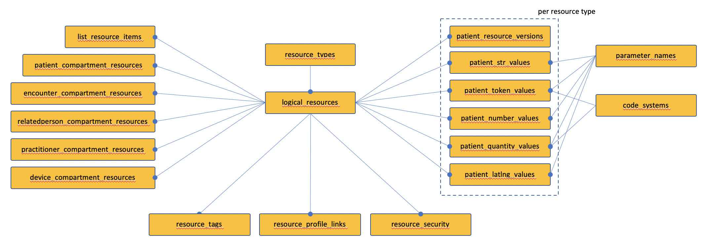
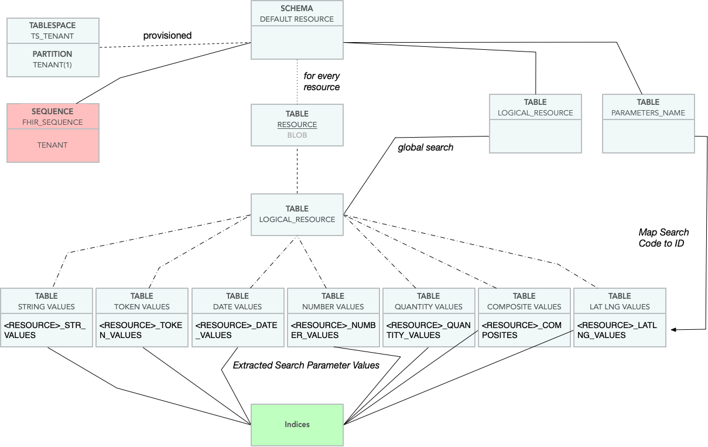

# The IBM FHIR Server - Schema Design and Management

This document details the IBM FHIR Server schema design and how schema changes are managed. There are differences among the databases currently supported, most notably with Db2 which uses additional database capabilities to support multi-tenancy. Details of the multi-tenant design can be found [here](DB2MultiTenancy.md). Other variations across databases are discussed in this document.

Currently it is not possible to deploy the simplified single-tenant variant of the schema to Db2. GitHub [issue-840](https://github.com/IBM/FHIR/issues/840) has been opened to address this. 


There are three core projects which are referenced: 

| Project | Description |
|----------|---------------------------------------------|
| `fhir-model` | The HL7 FHIR model - generated Java code |
| `fhir-database-utils` | The SQL/database constructs used to create SQL compliant statements |
| `fhir-persistence-schema` | Uses database-utils to define a physical data model for storing FHIR resources and supporting the FHIR API |

The schema generates the following object types that require management: 

- DB2 PACKAGE
- TABLESPACES
- SCHEMA 
- GLOBAL VARIABLE 
- INDEX 
- PERMISSION 
- PROCEDURE 
- SEQUENCE 
- TABLE
- TABLE CONSTRAINT 

----------------------------------------------------------------
# Database Support


| Database   | Version   | Support |
|------------|-----------|-----------------------------------|
| DB2        |      11.5 | Suitable for production. Supports multi-tenancy. |
| PostgreSQL |        12 | Experimental. Single tenant per database. |
| Derby      | 10.14.2.0 | Development only. Single tenant per database |


----------------------------------------------------------------
# Overview and Concepts

The IBM FHIR schema is managed in code and is applied to a target database using a JDBC connection. This simplifies development of Derby-based unit-tests, allows a common schema definition to be used across multiple database flavors, simplifies deployment in cloud scenarios, and because the data model dependencies are understood by the code, the schema creation process can be parallelized to reduce deployment times. In practice, however, we've found that the number of threads must be limited due to driving contention in the internal catalog tables (in DB2, for example). We have also found that some parallel object create operations cause internal database deadlocks (notably creating foreign key relationships). The implementation contains a retry loop, but may fail if the retry limit is exceeded. Note that these deadlocks are internal to Db2, not the more common kind typically caused by poor application code.

The `FHIR_ADMIN` schema is used to manage meta-data related to the actual data schemas. A single database instance can be used to support multiple FHIR data schemas, as long as the FHIR_ADMIN schema structure doesn't change. At the time of writing, the IBM FHIR Server does not support more than one FHIR_ADMIN schema in a single database. If a use-case arises where this is required, it is simply a matter of identifying in code where FHIR_ADMIN is used as a constant and replacing instances with a configurable property, although an implementation may also want to consider protecting individual schemas from accidentally being managed by more than one FHIR_ADMIN schema. One possible use-case for this sharing is using a database instance for schema development work.

The `FHIR_ADMIN` schema also plays an important role in managing tenants in the Db2 multi-tenant implementation. See the [Db2 Multi-Tenant Schema Design](DB2MultiTenancy.md) for more details.


## Differences Among Database Implementations

The following table highlights the main differences among the database implementations currently supported:

| Database   | Variation |
| --------   | ----------|
| DB2        | Multi-tenant. Supports multiple but isolated tenants within one database/schema |
| DB2        | An SPL stored procedure is used to implement the resource storage logic, reducing the number of application server to database round-trips, improving performance |
| DB2        | Uses `FHIR_TS` tablespace for admin tables, and a tablespace per tenant |
| DB2        | `FHIR_TS` is created using a small extent size for efficiency |
| PostgreSQL | Uses a function for the resource persistence logic |
| PostgreSQL | TEXT type used instead of CLOB for large data values |
| Derby      | Resource persistence is implemented at the DAO layer as a sequence of individual statements instead of one procedure call. At a functional level, the process is identical. Simplifies debugging and supports easier unit-test construction. |


----------------------------------------------------------------
# Schema Management

Use of the schema management tool is described [here](https://github.com/IBM/FHIR/tree/master/fhir-persistence-schema/README.md).

The schema is managed using the class `com.ibm.fhir.schema.app.Main`. The `Main` class uses `FhirSchemaGenerator` to build a `PhysicalDataModel` which represents the schema as a Java data structure. This schema model is then applied to a database using an implementation of `IDatabaseAdapter` specific to the target database type (Derby, PostgreSQL or DB2). The adapter implements calls such as `createTable` and constructs the DDL statement appropriate for the target database. In some cases where the object type is not supported or not required for the given target database, the adapter can simply perform no operation (NOP).

The code models dependencies among the various objects such as foreign key relationships between tables. Others relationships are marked explicitly, such as stored procedure dependency on tables. To keep things simple, there are some `NopObject` markers used as a barrier during parallel deployment. This barrier is used to collect together a lot of dependencies into one place, allowing subsequent operations to just depend on the barrier object instead of each having to individually express a dependency to lots of objects.

The following example shows how we define a table in the schema. In this case, we are creating the global logical resources table (which is not resource-type specific):

```java
 1    public void addLogicalResources(PhysicalDataModel pdm) {
 2       final String tableName = LOGICAL_RESOURCES;
 3
 4       Table tbl = Table.builder(schemaName, tableName)
 5               .setTenantColumnName(MT_ID)
 6               .addBigIntColumn(LOGICAL_RESOURCE_ID, false)
 7               .addIntColumn(RESOURCE_TYPE_ID, false)
 8               .addVarcharColumn(LOGICAL_ID, LOGICAL_ID_BYTES, false)
 9               .addPrimaryKey(tableName + "_PK", LOGICAL_RESOURCE_ID)
10                .addUniqueIndex("UNQ_" + LOGICAL_RESOURCES, RESOURCE_TYPE_ID, LOGICAL_ID)
11                .setTablespace(fhirTablespace)
12                .addPrivileges(resourceTablePrivileges)
13                .addForeignKeyConstraint(FK + tableName + "_RTID", schemaName, RESOURCE_TYPES, RESOURCE_TYPE_ID)
14                .enableAccessControl(this.sessionVariable)
15                .build(pdm);

16        tbl.addTag(SCHEMA_GROUP_TAG, FHIRDATA_GROUP);
17        this.procedureDependencies.add(tbl);
18        pdm.addTable(tbl);
19        pdm.addObject(tbl);
20    }
```

Notes:

**Line 4.** Database objects are created using the fluent builder pattern to create an immutable definition.

**Line 5.** MT_ID is used as the tenant column. The tenant column is handled as an explicit property (rather than just addIntColumn) because it allows us to ignore it later depending on the database target the model is being applied to. Currenly only Db2 supports our multi-tenant design.

**Line 6.** Adds a column to table definition.

**Line 9.** Specifies the primary key. The columns in the PK definition must be added before addPrimaryKey is called.

**Line 10.** Adds a unique index to the table.

**Line 11.** Identifies the tablespace to be used for this table. All tables are created in a specific tablespace `FHIR_TS` created with a smaller than typical extent size. The model contains a large number of tables and indexes, and in the multi-tenant schema, the initial table/partition never holds any data. Using a smaller extent size significantly improves schema deployment time because the database has to allocate fewer pages for each object, and this also reduces waste from allocating space that would never be used.

**Line 12.** Adds the list of privileges that need to be applied to this table.

**Line 13.** Adds a foreign key relationship to a target table, which is RESOURCE_TYPES in this case.

**Line 14.** Adds access control to this table. Used only when the target database is Db2. 

**Line 15.** Fluent pattern - builds the immutable `Table` object. The model is passed as a parameter to permit some integrity checking, helping to ensure that the resulting object is valid before it is applied to any database.

**Line 17.** Adds this table as a dependency for the stored procedures. To keep things simple, we say that all tables must be complete before any stored procedures are processed.

**Line 18.** Adds this object as a table to the `PhysicalDataModel`. The set of tables are used to perform lookups when foreign key relationships are added.

**Line 19.** Adds this object to the full list of objects in the `PhysicalDataModel`.

There is room for improvement in the design around how objects are added to the model. The need to make two calls (addTable and addObject) is cumbersome and potentially error-prone.

Note that the object being built is a subclass of VersionedSchemaObject which assigned a version id of 1 for the initial creation of an object. Note that version numbers are tracked at the object level, not globally. This makes it far easier to manage changes to a given object.


### Schema Migration and Versioning

The VERSION_HISTORY table is used to record the logical schema version number of every object in the FHIR data schema. This history information is used to determine which deltas to apply to migrate the schema to the latest version. When schema changes are applied, the VERSION_HISTORY table is updated to reflect the latest version number of a particular object. The next time the schema update is run, this table is read, and only changes with a greater version number than the value recorded in the VERSION_HISTORY table are applied for a given object.

NOTE: Schema changes must always be carefully considered and in an ideal world are backward compatible - this is important when needing to roll back a change. Rolling back application code changes is as simple as deploying an older version, but rolling back a database change is often impossible. Designing in backward compatibility is tricky to do in practice, but should be considered for each change, especially if continuous availability is a goal.

The DDL for most objects (like tables) is specified once. Changes to the table structure are applied as alter statements and assigned an increasing version id. We use a simple version number tracking to identify which changes (deltas) need to be applied to a particular object.

The schema update utility first reads the VERSION_HISTORY table, loading all records for the target schema (e.g. FHIRDATA). The utility only applies changes which have a version number greater than the currently recorded version. Once the DDL has been applied successfully, the version number is updated in VERSION_HISTORY. This makes the processed idempotent. Subsequent runs of the schema update utility only apply changes which have a greater version id value than the most recently stored value for each object.


## TABLESPACES

The Db2 multi-tenant schema variant uses a tablespace per tenant. All other database implementations use the default tablespace.


----------------------------------------------------------------
## Schema: FHIR_ADMIN

The Schema FHIR_ADMIN is deployed once per database and contains tables used to manage schema version history and tenant access (in the case of a multi-tenant supported configuration). The schema contains 3 tables:

| Object | Notes | Purpose |
| ----- | ----- | ------- |
| VERSION_HISTORY | | Table used to track the schema version number for each of the managed objects in the data schema (usually FHIRDATA) |
| TENANTS | Db2 only | Table for mapping between tenant name and the tenant id used to isolate the tenant's data in the data schema |
| TENANT_KEYS | Db2 only | Authorization keys allocated to a given given. A tenant can have multiple valid keys at any point in time to support rolling key changes (add new before remove old).
| TENANT_SEQUENCE | Db2 only | Sequence used to provide unique mt_id values for allocated tenants |
| SET_TENANT | Db2 only | Stored procedure. The only way for FHIRUSER to set the value of the SV_TENANT_ID session variable.


These table definitions are more completely described in [DB2MultiTenancy.md](DB2MultiTenancy.md). 


----------------------------------------------------------------

# Schema: FHIR Resource Data 

The IBM FHIR Server persists resources using tables defined in a data schema (usually FHIRDATA, but this can be anything). Multiple data schemas can exist in the same database, all managed from a single FHIR_ADMIN schema.

> 

The schema includes a group of tables used to support FHIR global searches and a group of tables defined per resource, with each table prefixed with the resource name, for example:

* patient_logical_resources, patient_resources, patient_str_values
* observation_logical_resources, observation_resources, observation_str_values
* etc

Each group is generated by the `FhirResourceTableGroup` class which is called for each value from `FHIRResourceType.ValueSet`.

The purpose of each table is summarized here:

| Table Name | Scope | Purpose |
| ---------- | ----- | ------- |
| resource_types | Metadata | Record for each type of resource in the FHIR specification |
| parameter_names | Metadata | Record for each unique search parameter name |
| code_systems | Metadata | Record for each unique code system |
| logical_resources | Global | Record for each resource regardless of type |
| resource_tags | Global | See [FHIR R4 Search Tag](https://www.hl7.org/fhir/search.html#tag) |
| resource_profile_links | Global | See [FHIR R4 Search Profile](https://www.hl7.org/fhir/search.html#profile) |
| resource_security | Global | See [FHIR R4 Search Security](https://www.hl7.org/fhir/search.html#security) |
| list_resource_items | Global | See [FHIR R4 Search List](https://www.hl7.org/fhir/search.html#list) |
| patient_compartment_resources | Global | (future) Compartment-based searches |
| encounter_compartment_resources | Global | (future) Compartment-based searches |
| relatedperson_compartment_resources | Global | (future) Compartment-based searches |
| practitioner_compartment_resources | Global | (future) Compartment-based searches |
| device_compartment_resources | Global | (future) Compartment-based searches |
| [resource]_logical_resources | Resource | Record for each instance of the given resource type (e.g. patient) |
| [resource]_resources | Resource | Record for each resource version of type [resource] |
| [resource]_str_values | Resource | String search parameter values for type [resource] |
| [resource]_token_values | Resource | Token search parameter values for type [resource] |
| [resource]_number_values | Resource | Number search parameter values for type [resource] |
| [resource]_quantity_values | Resource | Quantity search parameter values for type [resource] |
| [resource]_latlng_values | Resource | Lat/Long search parameter values for type [resource] |
| [resource]_composites | Resource | Composite search values for [resource] |

The schema only stores search values relevant to the most recent resource version.

The global compartment resource tables are being considered for a future release. These tables are designed to improve the efficiency of compartment-based [searches](https://www.hl7.org/fhir/search.html).


> 


Each data schema contains the following sequences:

| Sequence Name | Description |
|----------|---------------------------------------------|
| `fhir_sequence` | Provides sequence numbers for the normalized resource ids |
| `fhir_ref_sequence` | Provides sequence numbers for reference tables such as PARAMETER_NAMES, CODE_SYSTEMS and RESOURCE_TYPES |

These sequences should not require updating and should never be altered as this would risk the integrity of existing data.


## LOGICAL_RESOURCES and RESOURCES

Each LOGICAL_RESOURCES record represents an instance of the corresponding type (e.g. Patient, Practitioner or Observation). Each RESOURCES record represents a particular version of that instance (e.g. version 1 of Patient One or version 15 of Patient Two). There is a one-many relationship between LOGICAL_RESOURCES and RESOURCES.

The one LOGICAL_RESOURCES table not prefixed with a resource type name is used to support global search across all resource types. At the time of writing, this table is populated, but the IBM FHIR Server query generator does not yet leverage this capability, instead relying on a union approach.

The following table describes the difference among the different key column names. These names were inherited from older schema implementations, which makes them a little harder to grasp initially:

| Column Name | Description |
| ----------- | ----------- |
| LOGICAL_ID  | The application value used to uniquely identify logical resource records. This value is passed by the application and is typically some form of UUID, and aligns with the FHIR `Resource.Id` |
| LOGICAL_RESOURCE_ID | The database assigned primary key for the LOGICAL_RESOURCES table |
| RESOURCE_ID | The database assigned primary key for the RESOURCES table |


## Managing Resource Tables 

The resource tables store the FHIR resource as a compressed blob and so changes to the specification or extensions should only impact Search values.

The data definition has several reference tables to support FHIR Search for each resource type. Each of the following table types are defined in the `FHIRResourceTableGroup.java`. 

| Search Parameter Types | Search Value Table | Description |
|------------------------|--------------------|-------------|
| [Number](https://www.hl7.org/fhir/r4/search.html#number) | **`<RESOURCE>`_NUMBER_VALUES** | Numerical Search |
| [Date/DateTime](https://www.hl7.org/fhir/r4/search.html#date) | **`<RESOURCE>`_DATE_VALUES** | Date Search |
| [String](https://www.hl7.org/fhir/r4/search.html#string)<br> [Uri](https://www.hl7.org/fhir/r4/search.html#uri)<br> [Reference](https://www.hl7.org/fhir/r4/search.html#reference)| **`<RESOURCE>`_STR_VALUES** | String, URI, and Reference Search |
| [Token](https://www.hl7.org/fhir/r4/search.html#token) | **`<RESOURCE>`_TOKEN_VALUES** | Token Search |
| [Composite](https://www.hl7.org/fhir/r4/search.html#composite) | **`<RESOURCE>`_COMPOSITES** | Composite Search |
| [Quantity](https://www.hl7.org/fhir/r4/search.html#quantity) | **`<RESOURCE>`_QUANTITY_VALUES** | Quantity Search |
| [Positional](https://www.hl7.org/fhir/r4/location.html#positional) | **`<RESOURCE>`_LATLNG_VALUES** | Positional (near) Search |

For instance, for VISIONPRESCRIPTION there are: 

```
VISIONPRESCRIPTION_NUMBER_VALUES
VISIONPRESCRIPTION_DATE_VALUES
VISIONPRESCRIPTION_STR_VALUES
VISIONPRESCRIPTION_TOKEN_VALUES
VISIONPRESCRIPTION_COMPOSITES
VISIONPRESCRIPTION_QUANTITY_VALUES
VISIONPRESCRIPTION_LATLNG_VALUES
```

Because search parameters only apply to the most recent version of a resource, the search values tables are children of LOGICAL_RESOURCE.

The tables have a number of indexes which are created in class `FhirResourceTableGroup`. These indexes are carefully designed to support optimal query execution plans for FHIR queries.


## Modifying Table Definitions

To modify a table definition:
1. Increment the version of the table (`setVersion`)
2. Add migration steps to move from any previous version of the Table to this version

For example, for the `STRING_VALUES` table:

``` java
// Parameters are tied to the logical resource
Table tbl = Table.builder(schemaName, tableName)
    .setVersion(2)
    .addTag(FhirSchemaTags.RESOURCE_TYPE, prefix)
    .setTenantColumnName(MT_ID)
    .addBigIntColumn(             ROW_ID,      false)
    .addIntColumn(     PARAMETER_NAME_ID,      false)
    .addVarcharColumn(         STR_VALUE, msb,  true)
    .addVarcharColumn(   STR_VALUE_LCASE, msb,  true)
    .addBigIntColumn(LOGICAL_RESOURCE_ID,      false)
    .addIndex(IDX + tableName + "_PSR", PARAMETER_NAME_ID, STR_VALUE, LOGICAL_RESOURCE_ID)
    .addIndex(IDX + tableName + "_PLR", PARAMETER_NAME_ID, STR_VALUE_LCASE, LOGICAL_RESOURCE_ID)
    .addIndex(IDX + tableName + "_RPS", LOGICAL_RESOURCE_ID, PARAMETER_NAME_ID, STR_VALUE)
    .addIndex(IDX + tableName + "_RPL", LOGICAL_RESOURCE_ID, PARAMETER_NAME_ID, STR_VALUE_LCASE)
    .addPrimaryKey(PK + tableName, ROW_ID)
    .setIdentityColumn(ROW_ID, Generated.BY_DEFAULT)
    .addForeignKeyConstraint(FK + tableName + "_PNID", schemaName, PARAMETER_NAMES, PARAMETER_NAME_ID)
    .addForeignKeyConstraint(FK + tableName + "_RID", schemaName, logicalResourcesTable, LOGICAL_RESOURCE_ID)
    .setTablespace(fhirTablespace)
    .addPrivileges(resourceTablePrivileges)
    .enableAccessControl(this.sessionVariable)
    .addMigration(priorVersion -> {
            List<IDatabaseStatement> statements = new ArrayList<>();
                if (priorVersion == 1) {
                    // Add statements here
                }
                return statements;
            })
    .build(model);
```

When the schema is applied for the first time, it creates the table (and related constructs) as according to the definition.
When the schema is applied to an existing database, the framework checks the `FHIR_ADMIN.VERSION_HISTORY` table and, 
if the version in the table is less than the version being applied, the framework invokes the Migrations *instead*
of calling CREATE with the table definition. **Care** should be taken to ensure that the migrated schema matches a freshly applied schema.
See [Testing migrations](#testing-migrations) for information on verifying the fidelity of the schema migrations.

NOTE: In Db2, certain alter table statements require a table REORG before the table becomes usable again. Additionally, the REORG
may commit the current "unit of work" which can prevent the "all or nothing" semantics of the migration. For these reasons, its recommended
to:
1. avoid destructive changes like dropping columns;
2. backup the database before invoking a migration; and
3. perform the migration offline

In this way, if a new resource is added to the specification, the schema utility automatically provisions the corresponding table on the next execution of the fhir-persistence-schema `--update-schema` action. 

Common reasons to modify the Resource tables are: 

- **Specification Change (Version-to-Version changes)**
    - The Resources are saved as Blobs in the database, and are transparent to the FHIR Version changes. The changes from version-to-version are resilient to field add-remove changes, type changes, and resources additions.  This migration must be done manually.
    - Resource removals must be done manually. 
- **Column Attribute Changes (Space, Value Type)**
    - As the column definitions change, a specific alter statement must be executed on the table, and constraints must be changed or relaxed. This migration must be done manually. Support for automating such updates may be added to a new release should they become necessary.
- **Index - Add or Remove or Update**
    - As indices are removed from the table definition, the removed indices must be manually dropped for each Resource table. 
    - As indices are added to the table definition, the version of the table must be updated, and the index must be applied and updated manually. Support for automating such updates may be added to a new release should they become necessary.
- **Constraint Updates** If there are Foreign Key updates, the changes must be applied manually and reflected in the code base. 
- **Search Parameter Changes (Specification and Tenant)**
    - If the the parameter type or code is changed, the PARAMETERS_NAME and the corresponding table must be updated to remove references to the removed parameter (based on `SearchParameter.code`). 
    - If there is a new or altered SearchParameter `code` added to the server, the SearchParameter values are only changed if/when the resource is updated. 
    - If a `SearchParameter.code` is removed, the corresponding parameter remains until the resource is reprocessed.  The code to parameter mapping remains in `PARAMETER_NAMES` table until manually removed. 

Each of these tables has row-level permissions based on the conditional READ-only global variable `SV_TENANT_ID`. For example, for AUDITEVENT_COMPOSITES:

``` sql
CREATE PERMISSION FHIRDATA.AUDITEVENT_COMPOSITES_TENANT
    ON FHIRDATA.AUDITEVENT_COMPOSITES FOR ROWS
    WHERE FHIRDATA.AUDITEVENT_COMPOSITES.MT_ID = FHIR_ADMIN.SV_TENANT_ID 
    ENFORCED FOR ALL ACCESS ENABLE ;
```

For security reasons, these permissions should not be removed, migrated, or altered. However, they are automatically REPLACED by the framework after applying migration steps to a given table (required for Db2).

## Managing Stored Procedures

*Db2 Multi-tenant and PostgreSQL Only*

In the tenant's schema, there are four stored procedures `add_code_system`, `add_parameter_name`, `add_resource_type`, and `add_any_resource` which are created.

Procedures are applied as CREATE OR REPLACE so the version number does not need to be increased, although assigning a higher number can help protect against accidentally overwriting a procedure with an older version.

``` java
ProcedureDef pd = model.addProcedure(this.schemaName, 
    ADD_CODE_SYSTEM, 
    FhirSchemaConstants.INITIAL_VERSION, 
    () -> SchemaGeneratorUtil.readTemplate(adminSchemaName, schemaName, ADD_CODE_SYSTEM.toLowerCase() + ".sql", null), 
    Arrays.asList(fhirSequence, codeSystemsTable, allTablesComplete), 
    procedurePrivileges);
```

When the `fhir-persistence-schema` actions are executed with `--grant-to`, the **INSERT**, **SELECT**, **UPDATE**, **DELETE**, **EXECUTE** grants are applied again, and the procedures are updated. Each Procedure privilege is reset upon re-executing the action. 

If you change the stored procedure signature, the `fhir-persistence-schema` does not automatically drop the prior stored procedure and signature, and the stored procedure MUST be dropped manually. If the signature is updated, it is recommended that support for DropProcedure is added to the model and database adapters so that this can be handled automatically.

## Managing GRANTS

The Db2 data definition secures data access using `GRANT` predicates. To update or change, use the `--grant-to` predicate to apply the grants.

If a grant is removed from the Java code, a manual process must be followed to remove or change the grant for the corresponding tables, procedures and variables.

# Testing migrations

We currently have two migration tests in place; one for Apache Derby which runs with the Maven build and one for Db2 which runs as part of the CI pipeline.

With each release of the IBM FHIR Server, these tests should be expanded to cover [at least] the migrations from the previous version.

## Testing migrations with Apache Derby

The `fhir-persistence-schema` project includes a single DerbyMigrationTest. Currently, this test invokes a copy of the FhirSchemaGenerator that was extracted from version 4.0.1 of the `fhir-persistence-schema` project and added directly to the package.

This was necessary because version 4.0.1 of the fhir-persistence-schema cli doesn't support deploying schemas for Apache Derby. However, starting with 4.1.0, we should use the released cli jar to deploy the previous versions of the schema. This will ensure the validity of the test and improve maintainability.

## Testing migrations with IBM Db2

The `fhir-install` module contains scripts for building Docker containers of the IBM FHIR Server and IBM Db2 and, optionally, bringing them up via `docker-compose`. When releasing new versions of the IBM FHIR Server, the `SCHEMA_VERSION` variable should be updated within `fhir-install/docker/copy-dependencies-db2-migration.sh` in order to test migrations from the previously released version of the `fhir-persistencne-schema` module.

## References
- [Git Issue: Document the schema migration process on the project wiki #270](https://github.com/IBM/FHIR/issues/270)
- [Db2 11.5: Extent sizes in table spaces](https://www.ibm.com/support/knowledgecenter/SSEPGG_11.5.0/com.ibm.db2.luw.admin.dbobj.doc/doc/c0004964.html)
- [Db2 11.5: Altering table spaces](https://www.ibm.com/support/producthub/db2/docs/content/SSEPGG_11.5.0/com.ibm.db2.luw.admin.dbobj.doc/doc/t0005096.html)

FHIR® is the registered trademark of HL7 and is used with the permission of HL7.
